# Azure AI Search — Complete Setup Guide for Microsoft Security Copilot

**Developer**: Dr Muataz Awad

This guide is the definitive end-to-end walkthrough for connecting an organizational knowledge base to Microsoft Security Copilot using the Azure AI Search plugin. It covers every step from creating Azure resources through to testing in Security Copilot, with screenshots from a real deployment.

> **Reference**: [Azure AI Search in Microsoft Security Copilot](https://learn.microsoft.com/en-us/copilot/security/plugin-azure-ai-search)

---

## What You Are Building

```
Your Documents (PDF, DOCX, TXT)
        ↓
Azure Blob Storage  (maseccopilotstore / security-kb-docs)
        ↓
Azure AI Search Wizard  →  Azure OpenAI text-embedding-ada-002
        ↓
Search Index: security-kb-rag  (text chunks + vectors)
        ↓
Security Copilot Plugin  →  Grounded responses from your KB
```

## Resources Created

| Resource | Name | Region | Purpose |
|---|---|---|---|
| Azure AI Search | `maseccopilotsearch` | Central US | Hosts the search index |
| Azure OpenAI | `maseccopilot-openai` | East US | Generates embeddings |
| Storage Account | `maseccopilotstore` | East US | Stores source documents |

---

## Phase 1 — Create Azure AI Search Service

### Step 1.1 — Basics Tab

In the Azure portal, go to **Create a resource** → **Azure AI Search** → **Create**. Fill in the Basics tab:

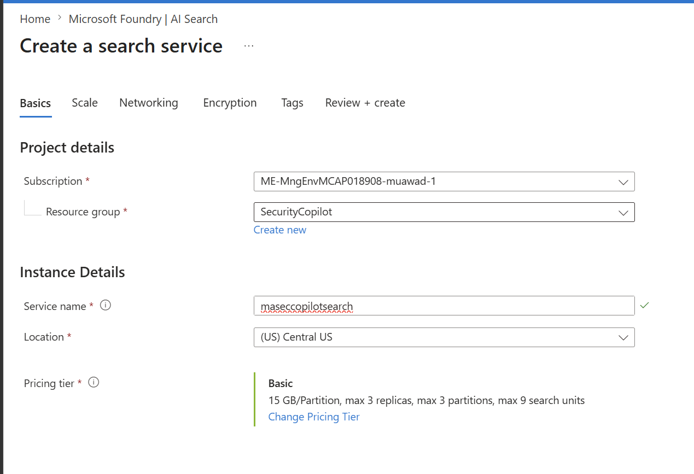

| Field | Value |
|---|---|
| **Resource group** | `SecurityCopilot` |
| **Service name** | `maseccopilotsearch` (green checkmark confirms availability) |
| **Location** | `(US) Central US` |
| **Pricing tier** | Click **Change Pricing Tier** → select **Basic** |

> **Naming rules**: lowercase letters, digits, and dashes only; 2–60 characters; no leading/trailing/consecutive dashes.

### Step 1.2 — Scale Tab

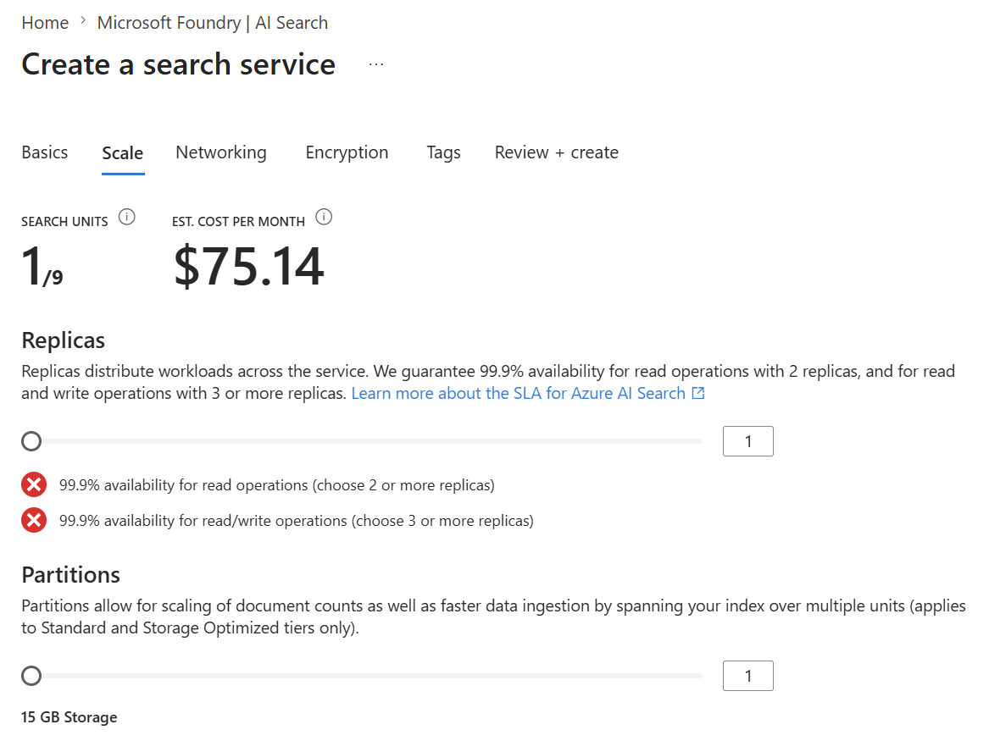

- **Replicas**: 1 (sufficient for pilot/dev; use 2+ for read SLA in production)
- **Partitions**: 1 × 15 GB (fixed on Basic tier)
- **Estimated cost**: ~$75.14/month

### Step 1.3 — Remaining Tabs

- **Networking**: Leave as **Public** (required for the wizard and Copilot plugin)
- **Encryption**: Leave as **Microsoft-managed keys**
- **Tags**: Optional

### Step 1.4 — Review + Create

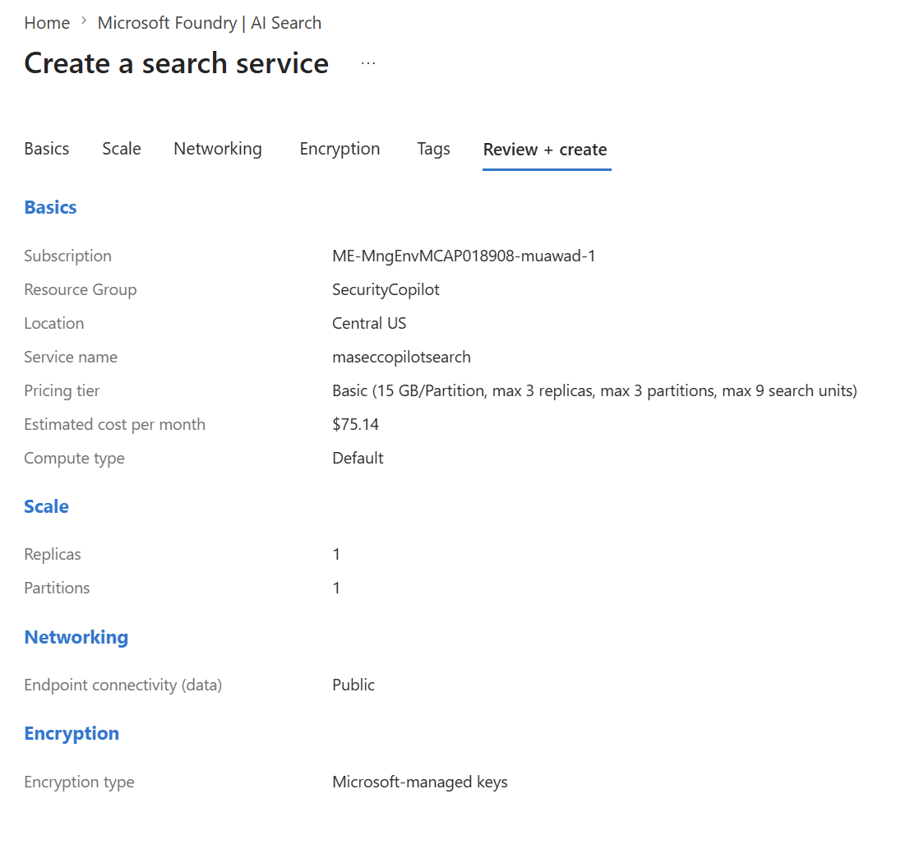

Verify all settings, then click **Create**. Deployment takes ~2–5 minutes.

### Step 1.5 — Enable Managed Identity

After deployment, go to your search service → **Security + networking** → **Identity** → **System assigned** tab → toggle **Status** to **On** → **Save**.

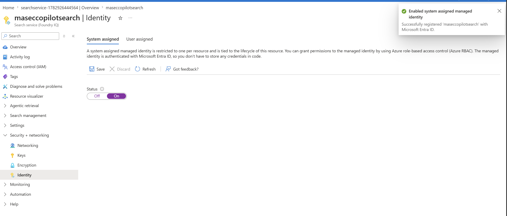

> A success notification confirms: *"Successfully registered 'maseccopilotsearch' with Microsoft Entra ID."*  
> This is required so the search service can access Azure Blob Storage and Azure OpenAI without API keys.

---

## Phase 2 — Create Azure OpenAI Service

### Step 2.1 — Choose Azure OpenAI

In the Azure portal, navigate to **Microsoft Foundry | Azure OpenAI** → **+ Create** → select **Azure OpenAI** (not Foundry).

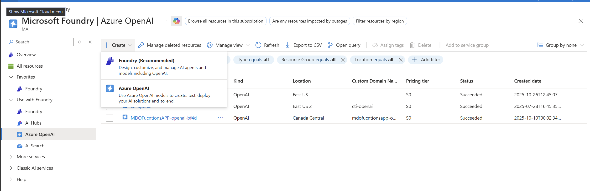

### Step 2.2 — Basics Tab

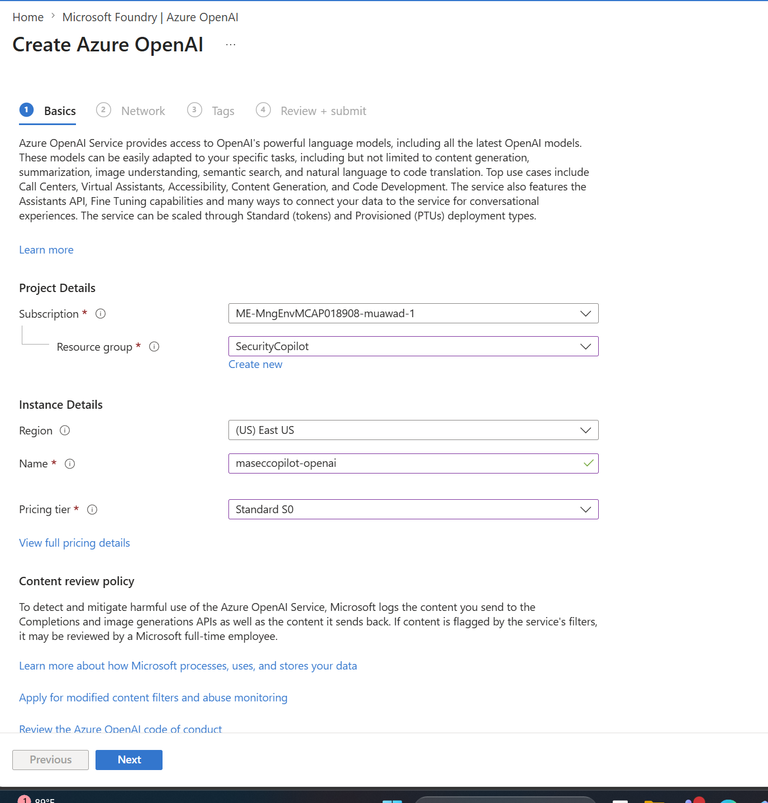

| Field | Value |
|---|---|
| **Resource group** | `SecurityCopilot` |
| **Region** | `(US) East US` |
| **Name** | `maseccopilot-openai` |
| **Pricing tier** | Standard S0 |

> **Note**: This resource is in East US while the search service is in Central US (different regions). This means managed identity authentication is used instead of API keys — this is fully supported and is configured in Phase 3.

### Step 2.3 — Review + Submit

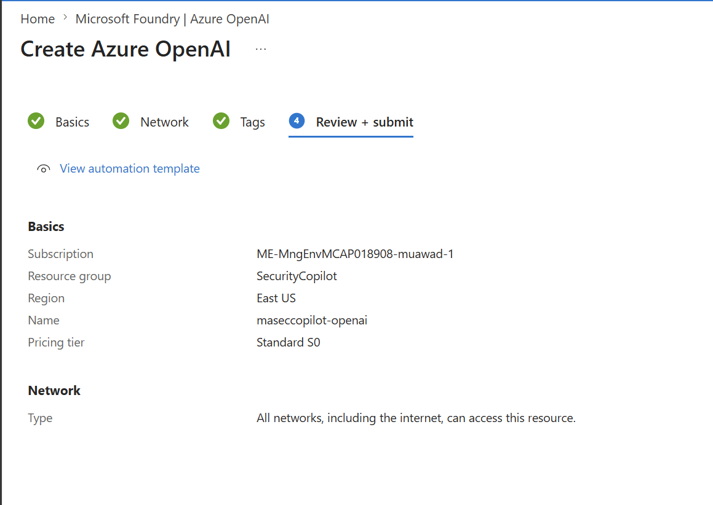

Verify: Resource group `SecurityCopilot`, Region `East US`, Name `maseccopilot-openai`, Tier `Standard S0`, Network `All networks`. Click **Create**.

### Step 2.4 — Deploy the Embedding Model

Once deployed, go to the resource → click **Go to Foundry portal** → **Deployments** → **+ Deploy model** → search `text` → select **text-embedding-ada-002** → **Confirm**.

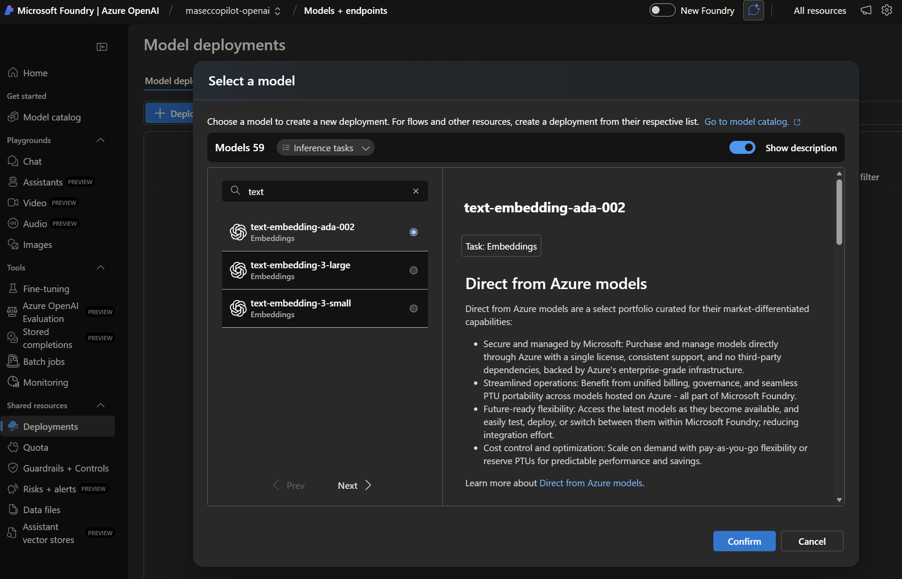

On the deployment form, verify the settings and click **Deploy**:

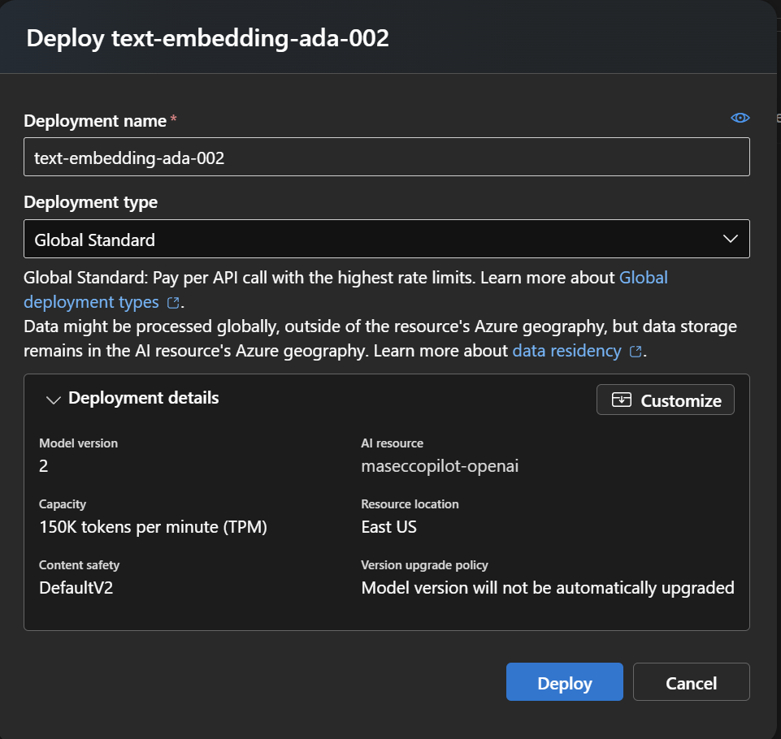

| Field | Value |
|---|---|
| **Deployment name** | `text-embedding-ada-002` — keep exactly this name |
| **Deployment type** | Global Standard |
| **AI resource** | maseccopilot-openai |
| **Capacity** | 150K tokens per minute |

Wait for **Provisioning state: Succeeded**.

---

## Phase 3 — Assign Role Permissions (PowerShell)

Because the tenant has `DisableLocalAuth: True` on both OpenAI and Storage resources, API keys are blocked by policy. The search service's managed identity must be granted explicit roles instead.

Run these commands in Azure PowerShell (sign in first with `Connect-AzAccount`):

### Step 3.1 — Get the Search Service Managed Identity Principal ID

```powershell
$search = Get-AzResource `
  -ResourceGroupName "SecurityCopilot" `
  -ResourceName "maseccopilotsearch" `
  -ResourceType "Microsoft.Search/searchServices"

$search | Select-Object -ExpandProperty Identity | Format-List *
```

Copy the **PrincipalId** value from the output — you will use it in the next two commands.

Example output:
```
PrincipalId : a1e576a2-cd4e-4b9e-b13a-8fb572f6aa00
TenantId    : e6cf700c-2029-4e98-aedd-f589e62f7316
Type        : SystemAssigned
```

### Step 3.2 — Grant Access to Azure OpenAI

```powershell
New-AzRoleAssignment `
  -ObjectId "<PrincipalId from Step 3.1>" `
  -RoleDefinitionName "Cognitive Services OpenAI User" `
  -Scope "/subscriptions/<subscriptionId>/resourceGroups/SecurityCopilot/providers/Microsoft.CognitiveServices/accounts/maseccopilot-openai"
```

### Step 3.3 — Grant Access to Storage Account

```powershell
New-AzRoleAssignment `
  -ObjectId "<PrincipalId from Step 3.1>" `
  -RoleDefinitionName "Storage Blob Data Reader" `
  -Scope "/subscriptions/<subscriptionId>/resourceGroups/SecurityCopilot/providers/Microsoft.Storage/storageAccounts/maseccopilotstore"
```

> Replace `<PrincipalId from Step 3.1>` with the actual GUID and `<subscriptionId>` with your subscription ID. Both commands should return a role assignment confirmation. If you see `RoleAssignmentExists`, the role was already assigned — this is fine.

---

## Phase 4 — Create Storage Account and Upload Documents

### Step 4.1 — Create Storage Account

In the Azure portal, create a Storage Account with these settings:

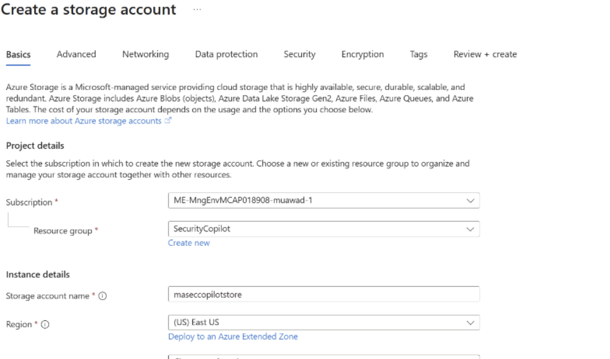

| Field | Value |
|---|---|
| **Resource group** | `SecurityCopilot` |
| **Storage account name** | `maseccopilotstore` |
| **Region** | East US |
| **Performance** | Standard |
| **Redundancy** | **LRS** (Locally redundant — sufficient for document indexing) |
| **Primary service** | Azure Blob Storage or Azure Data Lake Storage |

> Use **LRS** not GRS — GRS is unnecessary for knowledge base documents and costs ~50% more.

### Step 4.2 — Create a Container

Go to the storage account → **Data storage** → **Containers** → **+ Container**:

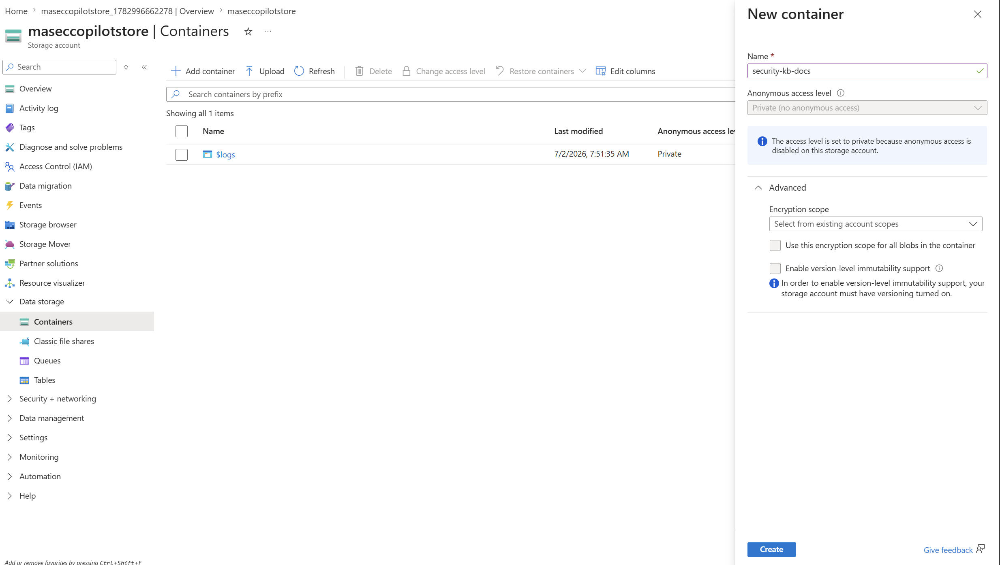

| Field | Value |
|---|---|
| **Name** | `security-kb-docs` |
| **Anonymous access level** | Private (no anonymous access) |

Click **Create**.

> **Authentication note**: The portal may show an access error when first viewing the container if the storage account has API keys disabled. Click **"Switch to Microsoft Entra user account"** to authenticate via Entra ID instead.

### Step 4.3 — Upload Documents

Open the `security-kb-docs` container → click **Upload** → upload your knowledge base documents:

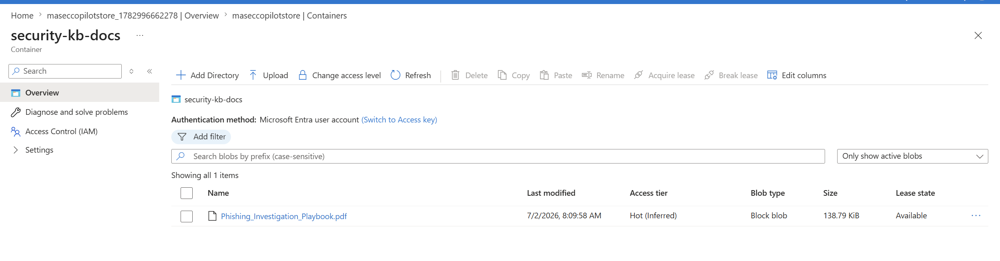

**Supported formats**: PDF, DOCX, TXT, MD, HTML

> **Important**: Ensure documents are **not password-protected or DRM-encrypted**. Protected PDFs will be indexed but will only return the protection error message rather than actual content.

**Recommended content to upload:**
- SOC runbooks and playbooks
- Incident response procedures
- Security policies and compliance documents
- KQL query libraries
- Threat intelligence reference documents

---

## Phase 5 — Build the Index with Import and Vectorize Wizard

Navigate back to your `maseccopilotsearch` search service → **Overview** → click **Import data**.

### Step 5.1 — Choose RAG

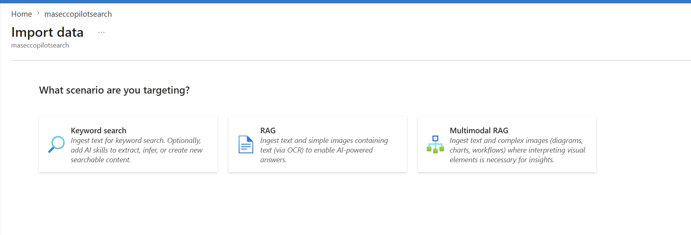

Select **RAG** — this creates a vector-enabled index with hybrid search capability, required by the Security Copilot plugin.

> Do not choose Keyword search (no vectors) or Multimodal RAG (for complex image content).

### Step 5.2 — Connect to Your Data

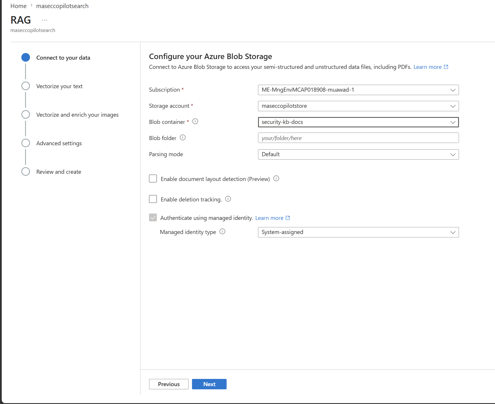

| Field | Value |
|---|---|
| **Subscription** | Your subscription |
| **Storage account** | `maseccopilotstore` |
| **Blob container** | `security-kb-docs` |
| **Blob folder** | Leave empty |
| **Parsing mode** | Default |
| **Enable document layout detection** | Unchecked |
| **Enable deletion tracking** | Unchecked |
| **Authenticate using managed identity** | ✅ **Check this** |
| **Managed identity type** | System-assigned |

Click **Next**.

### Step 5.3 — Vectorize Your Text

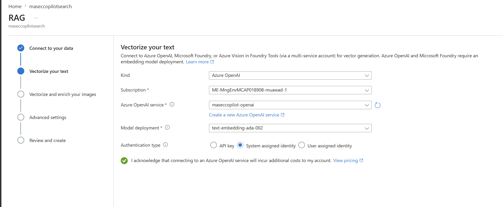

| Field | Value |
|---|---|
| **Kind** | Azure OpenAI |
| **Subscription** | Your subscription |
| **Azure OpenAI service** | `maseccopilot-openai` |
| **Model deployment** | `text-embedding-ada-002` |
| **Authentication type** | **System assigned identity** |
| **Billing acknowledgment** | ✅ Check |

> **Critical**: Select **System assigned identity** — API key authentication will fail because the tenant policy has `DisableLocalAuth: True` on the OpenAI resource.

Click **Next**.

### Step 5.4 — Vectorize and Enrich Your Images

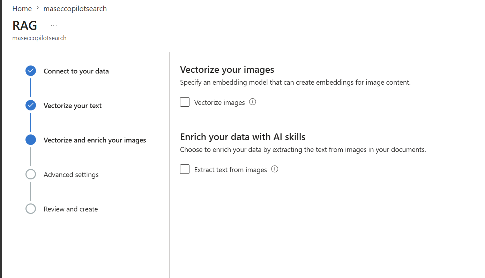

Leave **both checkboxes unchecked** — these are for image-heavy documents. For text-based security documents, skip this step entirely.

Click **Next**.

### Step 5.5 — Advanced Settings

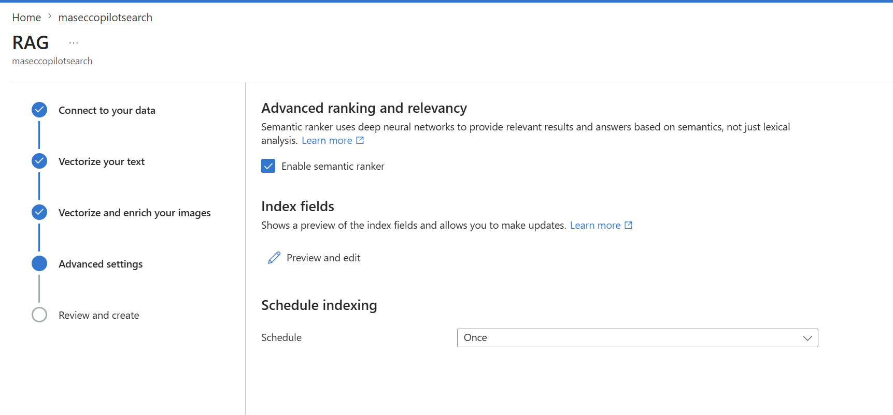

| Setting | Value |
|---|---|
| **Enable semantic ranker** | ✅ Checked — improves result quality in Copilot responses |
| **Index fields** | Leave default (auto-generated) |
| **Schedule** | Once |

Click **Next**.

### Step 5.6 — Review and Create

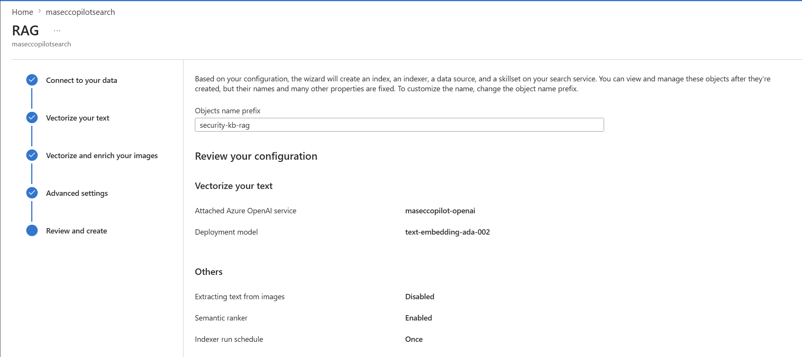

Change the **Objects name prefix** from the auto-generated value to something meaningful: `security-kb-rag`.

Verify:

| Setting | Value |
|---|---|
| **Attached Azure OpenAI service** | `maseccopilot-openai` |
| **Deployment model** | `text-embedding-ada-002` |
| **Extracting text from images** | Disabled |
| **Semantic ranker** | Enabled |
| **Indexer run schedule** | Once |

Click **Create**. The wizard creates 4 objects: an index, indexer, data source, and skillset — then immediately runs the indexer.

---

## Phase 6 — Verify the Index

### Step 6.1 — Check Indexer Status

Go to `maseccopilotsearch` → **Search management** → **Indexers**.

The `security-kb-rag-indexer` row should show:

| Column | Expected value |
|---|---|
| **Status** | ✅ Success |
| **Last run** | A few minutes ago |
| **Docs succeeded** | `1/1` (or more if you uploaded multiple files) |
| **Errors/Warnings** | `0/0` |

If status shows **In progress**, wait 1–2 minutes and click **Refresh**. If status shows **Failed**, click the indexer name to see the error detail — common causes are missing role assignments (Phase 3) or a protected PDF (Step 4.3).

### Step 6.2 — Confirm Index has Documents

Go to **Search management** → **Indexes**:

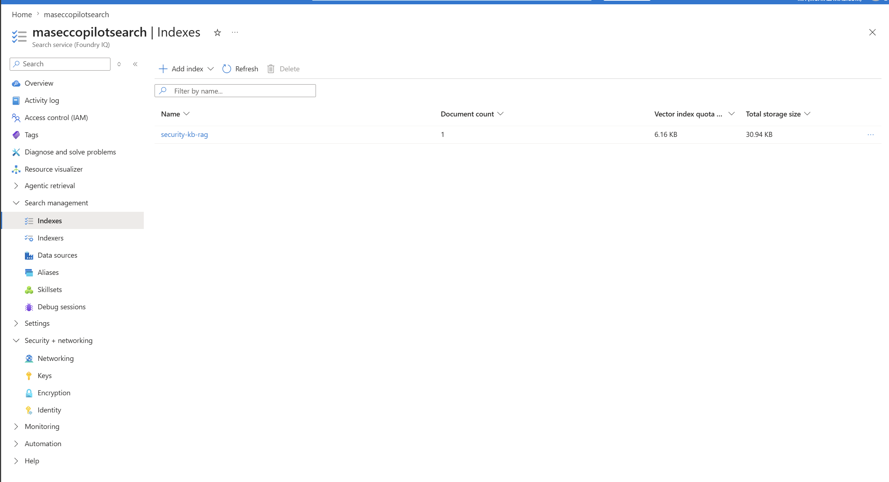

| Column | Value |
|---|---|
| **Name** | `security-kb-rag` |
| **Document count** | 1 (or more, depending on chunks) |
| **Vector index quota** | 6.16 KB |
| **Total storage size** | 30.94 KB |

### Step 6.3 — Note the Index Field Names

These field names are needed to configure the Security Copilot plugin. The RAG wizard always creates:

| Plugin field | Index field name |
|---|---|
| **Vector** | `text_vector` |
| **Text** | `chunk` |
| **Title** | `title` |

### Step 6.4 — Test the Index in Search Explorer

Before connecting to Security Copilot, validate that the index returns real content.

1. Click on `security-kb-rag` in the Indexes list → go to the **Search explorer** tab.
2. Type a keyword from your document (e.g. `phishing`) and click **Search**.

**What a successful result looks like:**
```json
{
  "@odata.count": 10,
  "@search.answers": [...],
  "value": [
    {
      "@search.score": 0.94,
      "@search.rerankerScore": 1.55,
      "chunk": "Investigation checklist  Initial message and recipient scope...",
      "title": "Phishing_Investigation_Playbook.pdf"
    }
  ]
}
```

- `@odata.count` should be greater than 0
- `chunk` should contain readable text from your document
- `title` should show your filename

**Known issue — "Could not complete vectorization action (404)":**
This error appears when using the simple search box in Search Explorer. It occurs because the Search Explorer tries to vectorize the query at query time, and the cross-region setup (Central US search → East US OpenAI) can cause this in the portal UI. **This does not affect the Security Copilot plugin** — the plugin sends its own query format and works correctly.

**If `chunk` returns a PDF protection message instead of real content:**
Your document is password-protected or DRM-encrypted. Replace it with an unprotected version: upload the new file to the `security-kb-docs` container, then go to **Indexers** → `security-kb-rag-indexer` → **Run** to re-index.

---

## Phase 7 — Connect to Microsoft Security Copilot

### Step 7.1 — Get the Search Service Query Key

Run this in Azure PowerShell:

```powershell
$keys = Invoke-AzRestMethod -Method POST `
  -Path "/subscriptions/<subscriptionId>/resourceGroups/SecurityCopilot/providers/Microsoft.Search/searchServices/maseccopilotsearch/listQueryKeys?api-version=2024-06-01-preview"
($keys.Content | ConvertFrom-Json).value | Select-Object name, key
```

Replace `<subscriptionId>` with your subscription ID (find it in Azure portal → Subscriptions). Copy the **key** value from the output — this is the read-only query key for the Copilot plugin.

### Step 7.2 — Configure the Plugin in Security Copilot

In Security Copilot, click the **Sources** icon in the prompt bar → **Microsoft** → **Azure AI search** → **Set up**.

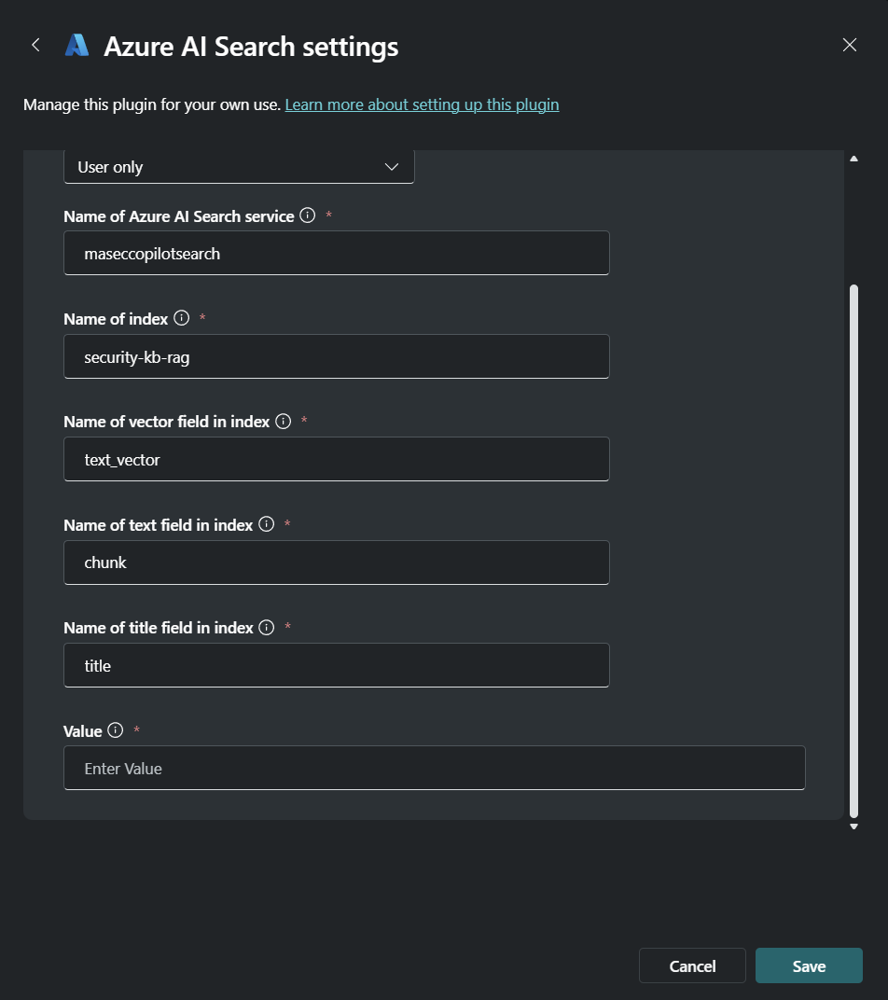

Fill in every field:

| Field | Value |
|---|---|
| **Configuration Level** | User only (personal) or For everyone (workspace-wide) |
| **Name of Azure AI Search service** | `maseccopilotsearch` |
| **Name of index** | `security-kb-rag` |
| **Name of vector field in index** | `text_vector` |
| **Name of text field in index** | `chunk` |
| **Name of title field in index** | `title` |
| **Value** | Your query key from Step 7.1 |

Click **Save**.

> Security Copilot does not validate credentials at save time. If credentials are incorrect, you will see an error when Copilot first invokes the plugin.

---

## Phase 8 — Test in Security Copilot

Open a new Copilot session and test with prompts that explicitly mention **"Azure AI Search"**:

```
Search Azure AI Search for phishing investigation checklist
```

```
Using Azure AI Search, what are the remediation steps for a phishing incident?
```

```
Search Azure AI Search for the at-a-glance workflow for phishing response
```

A successful response returns a Copilot-generated summary grounded in your document content, with source document titles listed below the response.

---

## Maintaining the Index

### Add new documents

1. Upload the new file to `maseccopilotstore` → `security-kb-docs` container
2. Go to `maseccopilotsearch` → **Search management** → **Indexers** → `security-kb-rag-indexer` → **Run**
3. Wait for **Success** status — the new document will be chunked, vectorized, and added to the index

### Schedule automatic re-indexing

In the indexer settings, change the **Schedule** from **Once** to **Every hour**, **Daily**, or **Weekly** to automatically pick up new documents added to the container.

---

## Troubleshooting

| Symptom | Cause | Fix |
|---|---|---|
| Plugin returns no results | Incorrect field names or credentials | Verify field names match exactly: `text_vector`, `chunk`, `title` |
| "Vectorization endpoint 404" in Search Explorer | Cross-region query-time vectorization | Use the JSON view for testing; the Copilot plugin is unaffected |
| PDF content not returned | PDF is password-protected | Upload an unprotected version of the document |
| Indexer fails | Role assignment missing | Re-run the Storage Blob Data Reader and Cognitive Services OpenAI User role assignments |
| Copilot doesn't invoke the plugin | Prompt doesn't mention "Azure AI Search" | Always include "Azure AI Search" explicitly in the prompt |
| Save fails with validation errors | Value field not filled | Enter the query key in the **Value** field before clicking Save |

---

## Reference

| Resource | Link |
|---|---|
| Azure AI Search plugin docs | [plugin-azure-ai-search](https://learn.microsoft.com/en-us/copilot/security/plugin-azure-ai-search) |
| Connect org knowledge base | [connect-org-kb](https://learn.microsoft.com/en-us/copilot/security/connect-org-kb) |
| Create search service | [search-create-service-portal](https://learn.microsoft.com/en-us/azure/search/search-create-service-portal) |
| Integrated vectorization | [search-get-started-portal-import-vectors](https://learn.microsoft.com/en-us/azure/search/search-get-started-portal-import-vectors) |

<!-- Repository maintenance marker -->
