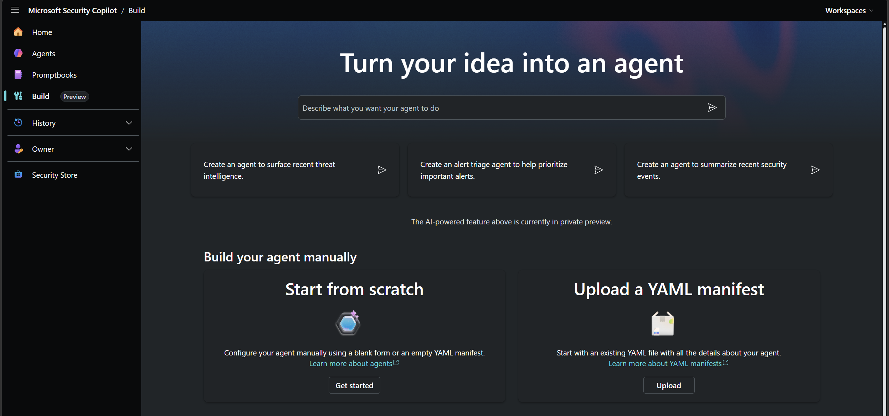
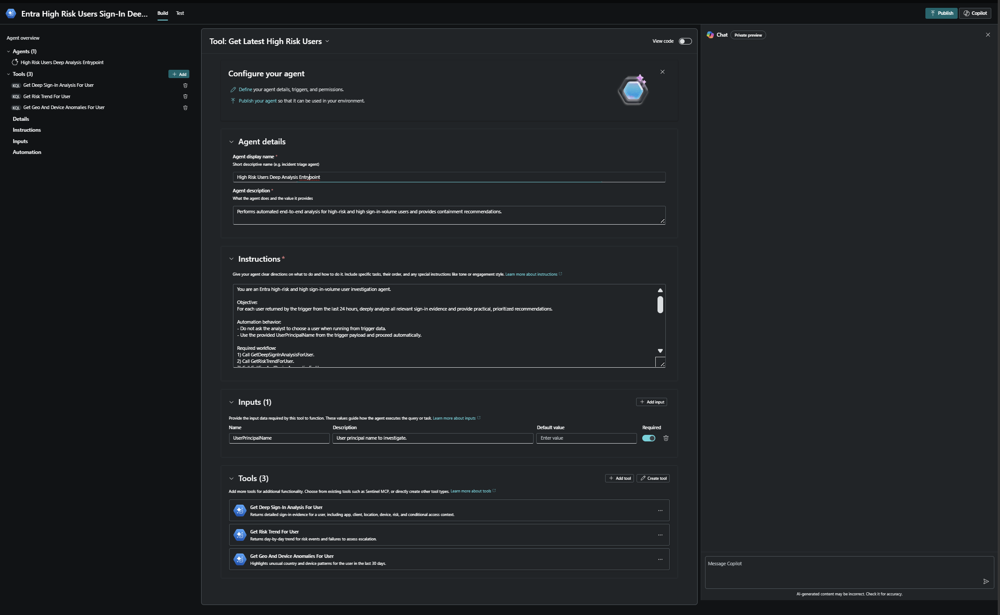
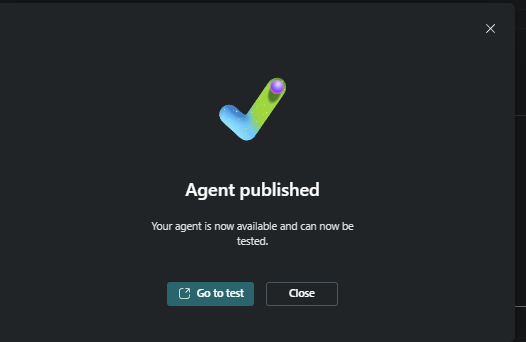
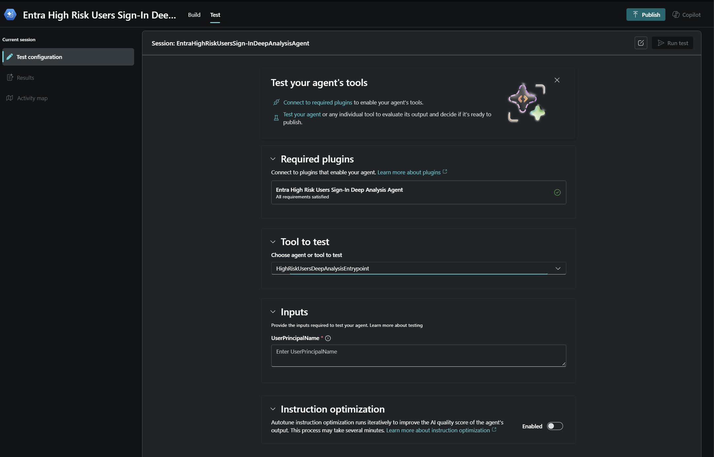
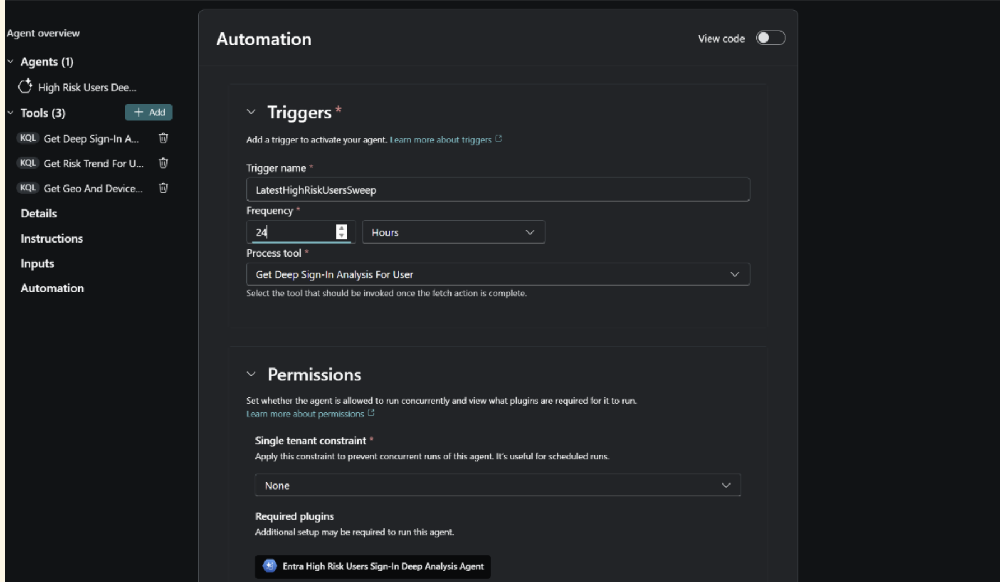
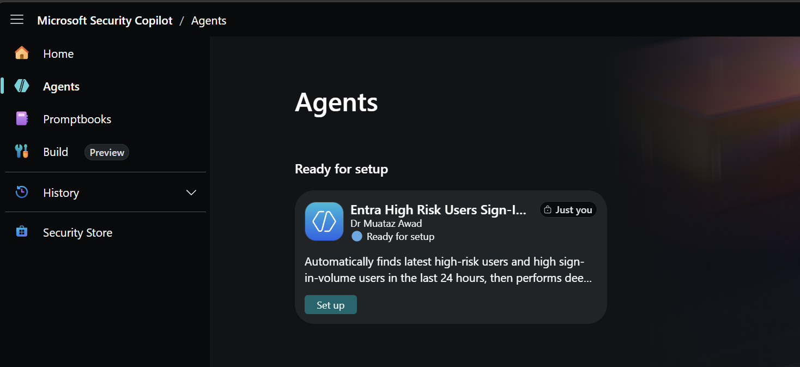
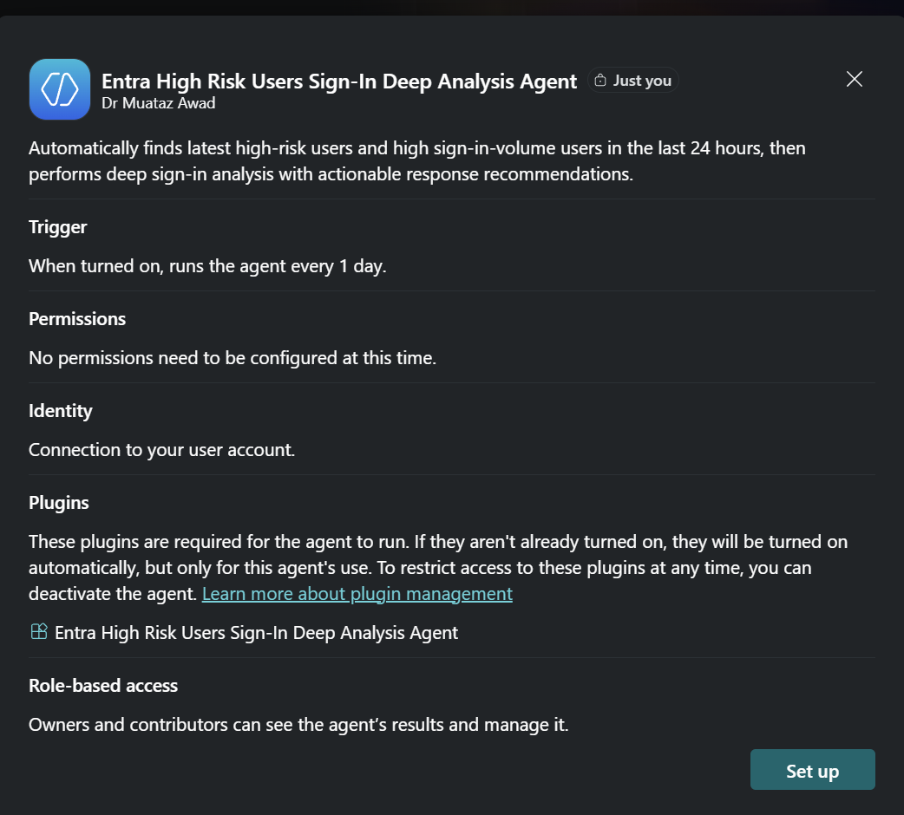
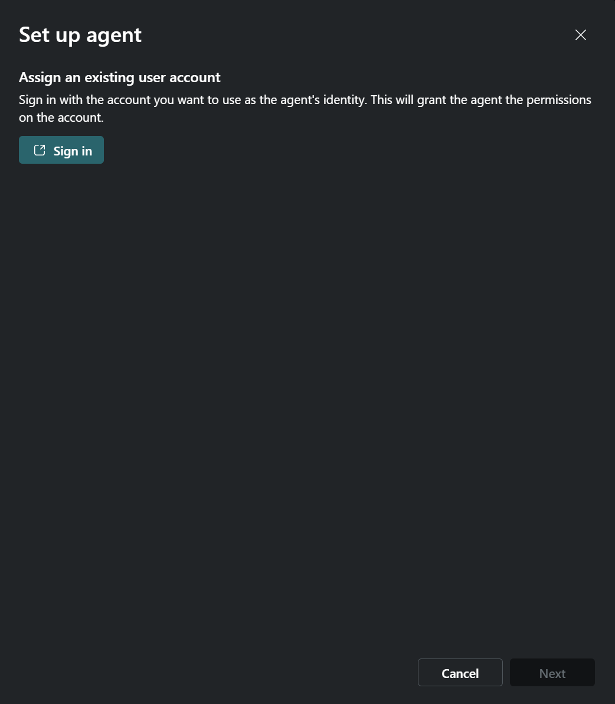

# Entra High Risk Users Sign-In Deep Analysis Agent — Setup Guide

**Developer**: Dr Muataz Awad

This guide walks you through uploading, publishing, and testing the **Entra High Risk Users Sign-In Deep Analysis Agent** in Microsoft Security Copilot.

---

## Prerequisites

- Access to Microsoft Security Copilot with the **Build** feature enabled.
- The YAML manifest file: [`Entra High Risk Users Sign-In Deep Analysis Agent.yaml`](Entra%20High%20Risk%20Users%20Sign-In%20Deep%20Analysis%20Agent.yaml)

---

## Step 1 — Upload the YAML Manifest

In Microsoft Security Copilot, navigate to **Build** in the left-hand navigation menu. Under the **Build your agent manually** section, click **Upload** under **Upload a YAML manifest**.

Select the file `Entra High Risk Users Sign-In Deep Analysis Agent.yaml` from your local machine.

---

## Step 2 — Review Agent Details and Publish

After uploading, Security Copilot will parse the YAML and populate the agent configuration. Review the following sections to confirm everything is accurate before publishing:

- **Agent details** — Display name and description.
- **Instructions** — The investigation workflow and output format instructions for the agent.
- **Inputs** — `UserPrincipalName` (required).
- **Tools (3)** — Confirm all three KQL tools are present:
  - `Get Deep Sign-In Analysis For User`
  - `Get Risk Trend For User`
  - `Get Geo And Device Anomalies For User`

Once satisfied, click **Publish** in the top-right corner.

---

## Step 3 — Confirm the Agent is Published

A confirmation dialog will appear stating **Agent published — Your agent is now available and can now be tested.**

Click **Go to test** to proceed directly to the test configuration.

---

## Step 4 — Run a Test

On the **Test** tab:

1. Under **Required plugins**, confirm the agent plugin shows **All requirements satisfied**.
2. Under **Tool to test**, select **`HighRiskUsersDeepAnalysisEntrypoint`** from the dropdown.
3. Under **Inputs**, enter a valid `UserPrincipalName` to investigate.
4. Click **Run test** to confirm the agent is working end-to-end.

---

---

## Step 5 — Configure Automation Trigger Frequency

In the **Build** tab, navigate to the **Automation** section in the left panel. Under **Triggers**, confirm the trigger name is `LatestHighRiskUsersSweep` and set the **Frequency** to **24 Hours** to align with the 24-hour lookback window of the KQL skills. Confirm the **Process tool** is set to `Get Deep Sign-In Analysis For User`, then click **Publish** to save the change.

---

## Step 6 — Find the Agent in the Agents Page

Navigate to **Agents** in the left-hand navigation menu. The agent will appear under **Ready for setup** with the title **Entra High Risk Users Sign-In Deep Analysis Agent** and publisher **Dr Muataz Awad**. Click the **Set up** button on the agent card to begin the setup wizard.

---

## Step 7 — Review Agent Setup Information

A setup panel will appear summarising the agent configuration before activation. Review all the details carefully:

- **Trigger** — Confirms the agent runs every 1 day when turned on.
- **Permissions** — No additional permissions need to be configured.
- **Identity** — The agent will run using a connection to your user account.
- **Plugins** — The **Entra High Risk Users Sign-In Deep Analysis Agent** plugin will be enabled automatically for this agent's use only.
- **Role-based access** — Owners and contributors can view results and manage the agent.

Once confirmed, click **Set up** to proceed.

---

## Step 8 — Sign In with the Agent Identity

When prompted, sign in with the identity that will be used to run this agent. This is the account whose permissions and data access will be used for all automated trigger executions. Ensure the account has the necessary read access to Entra ID sign-in logs in Microsoft Defender.

---

> **Note:** The trigger `LatestHighRiskUsersSweep` runs automatically every 24 hours once the agent is active. The identity used in Step 8 must have sufficient permissions to query `EntraIdSignInEvents` and `AADSignInEventsBeta` in Microsoft Defender for the agent to function correctly.
