# Password Spray Auto-Alert

[← Logic Apps Module](../../README.md)

A Logic App that polls Entra ID Protection every 30 minutes for `passwordSpray` risk detections and immediately sends a critical HTML alert email when spray activity is detected. Includes affected accounts, source IPs, geographic locations, risk levels, Quick Actions, a 3-phase analyst response guide aligned to the Microsoft Password Spray playbook, and an embedded Security Copilot investigation prompt.

**What it detects:** `riskEventType: passwordSpray` from the Microsoft Graph `identityProtection/riskDetections` API

**What it sends:** An immediate alert email with a detection table, Quick Actions box, and full phased analyst response guide. **No email is sent if no detections are found** — this is an event-driven alert, not a digest.

**Developer**: Dr Muataz Awad

---

## How It Works

## Architecture


```
Every 30 minutes
    │
    ▼
Compute time window start  →  utcNow() - 30 min  →  "2026-07-13T09:00:00Z"
    │
    ▼
GET /identityProtection/riskDetections
    $filter: riskEventType eq 'passwordSpray'
       and detectedDateTime ge {timeWindowStart}
    │
    ├─ No detections  →  Exit silently (no email)
    │
    └─ Detections found
           │
           ▼
       For each detection
           └─> Format HTML table row (Account, Source/Location, Risk, Time, Actions)
           │
           ▼
       Compose full HTML alert email
       (Quick Actions + 3-phase analyst guide + Security Copilot prompt)
           │
           ▼
       POST /users/{senderEmail}/sendMail
```

---

## Prerequisites

- Azure subscription with Global Administrator or Security Administrator role
- Microsoft Entra ID P2 license (required for Identity Protection risk detections)
- Exchange Online license on the sender mailbox

---

## Deployment

### Option A — Deploy to Azure (one-click)

Click the button below to deploy directly to your Azure subscription:

[](https://portal.azure.com/#create/Microsoft.Template/uri/https%3A%2F%2Fraw.githubusercontent.com%2FMuatazawad2%2FSecurityCopilot%2Fmain%2FLogic%2520Apps%2520Module%2FPassword%2520Spray%2520Detection%2FPassword%2520Spray%2520Auto-Alert%2Fazuredeploy.json)

You will be prompted to enter:
- **Resource Group** — existing resource group in your subscription
- **Sender Email** — mailbox the alert comes FROM (must exist in your tenant)
- **Recipient Email** — mailbox or distribution list to send TO
- **Polling Interval Minutes** — how often to check (default: `30`)

After deployment, grant the Managed Identity the required Graph permissions — see **Step 3** in the manual setup guide below.

### Option B — PowerShell

```powershell
.\deploy.ps1 -SenderEmail "security-alerts@company.com" `
             -RecipientEmail "soc-team@company.com" `
             -ResourceGroup "rg-security"
```

The script deploys the ARM template and automatically grants all required Graph permissions.

---

## Required Graph Permissions

| Permission | App Role ID | Purpose |
|------------|-------------|---------|
| `IdentityRiskEvent.Read.All` | `6e472fd1-ad78-48da-a0f0-97ab2c6b769e` | Read password spray risk detections |
| `AuditLog.Read.All` | `b0afded3-3588-46d8-8b3d-9842eff778da` | Read sign-in logs for investigation context |
| `Mail.Send` | `b633e1c5-b582-4048-a93e-9f11b44c7e96` | Send alert emails via Microsoft Graph |

---

## Step-by-Step Manual Setup Guide

### Step 1 — Create the Logic App

1. Go to [portal.azure.com](https://portal.azure.com) → search **Logic Apps** → click **+ Create**
2. Select your **Resource Group**, enter name `password-spray-auto-alert`, choose **Consumption** plan, select your region
3. Click **Review + Create** → **Create**

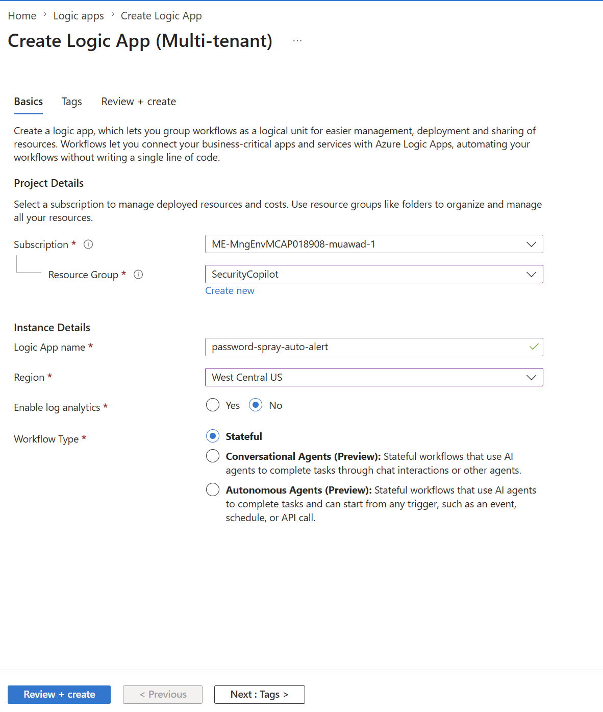

---

### Step 2 — Enable System-Assigned Managed Identity

1. Open the Logic App → left menu → **Settings** → **Identity**
2. Under **System assigned**, toggle **Status** to **On**
3. Click **Save** → note the **Object (principal) ID** — you will need it for Step 3

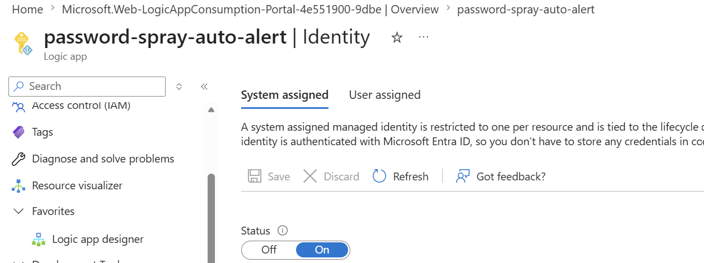

---

### Step 3 — Grant Microsoft Graph Permissions

#### Option A — Azure Cloud Shell (recommended)

1. Go to [shell.azure.com](https://shell.azure.com) → select **PowerShell**
2. Paste and run the script below, replacing the principal ID with your value from Step 2:

```powershell
$token = (az account get-access-token --resource https://graph.microsoft.com --query accessToken -o tsv)
$headers = @{ Authorization = "Bearer $token"; "Content-Type" = "application/json" }

$graphSp   = Invoke-RestMethod -Method GET -Uri "https://graph.microsoft.com/v1.0/servicePrincipals?`$filter=appId eq '00000003-0000-0000-c000-000000000000'" -Headers $headers
$graphSpId = $graphSp.value[0].id
$principalId = "YOUR-MANAGED-IDENTITY-OBJECT-ID"   # from Step 2

$permissions = @(
  @{ Name = "IdentityRiskEvent.Read.All"; Id = "6e472fd1-ad78-48da-a0f0-97ab2c6b769e" },
    @{ Name = "AuditLog.Read.All";          Id = "b0afded3-3588-46d8-8b3d-9842eff778da" },
    @{ Name = "Mail.Send";                  Id = "b633e1c5-b582-4048-a93e-9f11b44c7e96" }
)

$uri = "https://graph.microsoft.com/v1.0/servicePrincipals/$graphSpId/appRoleAssignedTo"
foreach ($perm in $permissions) {
    $body = @{ principalId = $principalId; resourceId = $graphSpId; appRoleId = $perm.Id } | ConvertTo-Json
    try {
        $null = Invoke-RestMethod -Method POST -Uri $uri -Headers $headers -Body $body
        Write-Host "GRANTED: $($perm.Name)" -ForegroundColor Green
    } catch { Write-Host "ALREADY EXISTS or ERROR: $($perm.Name)" -ForegroundColor Yellow }
}
```

#### Option B — Graph Explorer

1. Go to [Graph Explorer](https://developer.microsoft.com/en-us/graph/graph-explorer) → sign in as Global Administrator
2. Find the Graph service principal ID:
   ```
   GET https://graph.microsoft.com/v1.0/servicePrincipals?$filter=appId eq '00000003-0000-0000-c000-000000000000'&$select=id
   ```
3. For each permission in the table above, run:
   ```
   POST https://graph.microsoft.com/v1.0/servicePrincipals/{graphSpId}/appRoleAssignedTo
   ```
   Body:
   ```json
   {
     "principalId": "YOUR-MANAGED-IDENTITY-OBJECT-ID",
     "resourceId": "{graphSpId}",
     "appRoleId": "{App Role ID from table above}"
   }
   ```

**Verify:** Entra ID → Enterprise Applications → search `password-spray-auto-alert` → Security → Permissions — all 3 permissions should appear under Admin consent.

---

### Step 4 — Open the Logic App Designer

1. Open the Logic App → left menu → **Logic app designer**
2. Click **+ Add trigger**

---

### Step 5 — Add Recurrence Trigger

1. Select **Schedule** → **Recurrence**
2. Configure:
   - **Interval**: `30`
   - **Frequency**: `Minute`

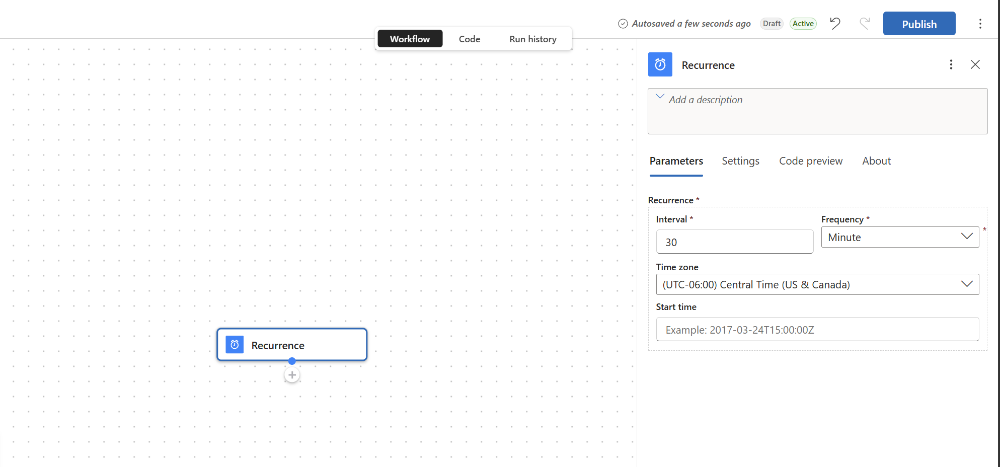

---

### Step 6 — Add Compose Action (Compute Time Window)

1. Click **+** → **Add an action** → search `Compose` → select **Compose** (Built-in)
2. Rename to `Compute_TimeWindow_Start`
3. In **Inputs**, switch to expression mode (`fx`) and enter:
   ```
   formatDateTime(addMinutes(utcNow(), -30), 'yyyy-MM-ddTHH:mm:ssZ')
   ```
   > Produces a timestamp 30 minutes in the past used to filter only new detections each run.

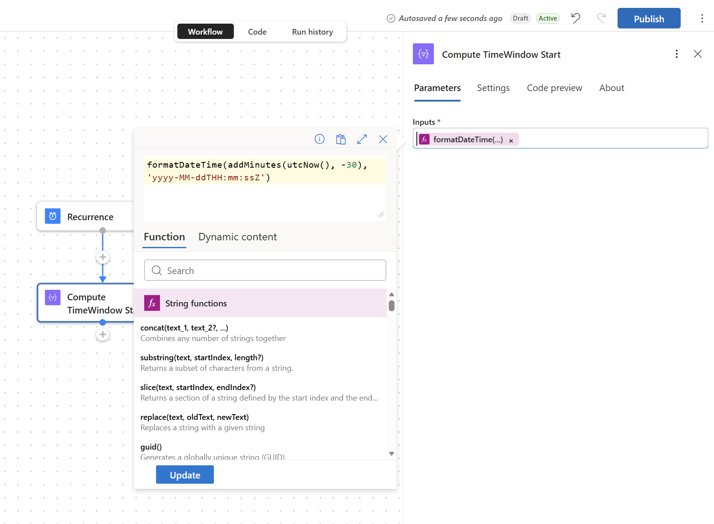

---

### Step 7 — Add HTTP Action (Get Password Spray Detections)

1. Click **+** → **Add an action** → search `HTTP` → select **HTTP** (Built-in)
2. Rename to `Get_PasswordSpray_Detections`
3. Configure:
   - **Method**: `GET`
   - **URI**: `https://graph.microsoft.com/v1.0/identityProtection/riskDetections`
   - **Queries**:

| Key | Value |
|-----|-------|
| `$filter` | `riskEventType eq 'passwordSpray' and detectedDateTime ge @{outputs('Compute_TimeWindow_Start')}` |
| `$select` | `id,userId,userDisplayName,userPrincipalName,riskLevel,riskState,ipAddress,detectedDateTime,location` |
| `$orderby` | `detectedDateTime desc` |
| `$top` | `50` |

4. **Authentication**: Managed identity / audience `https://graph.microsoft.com`

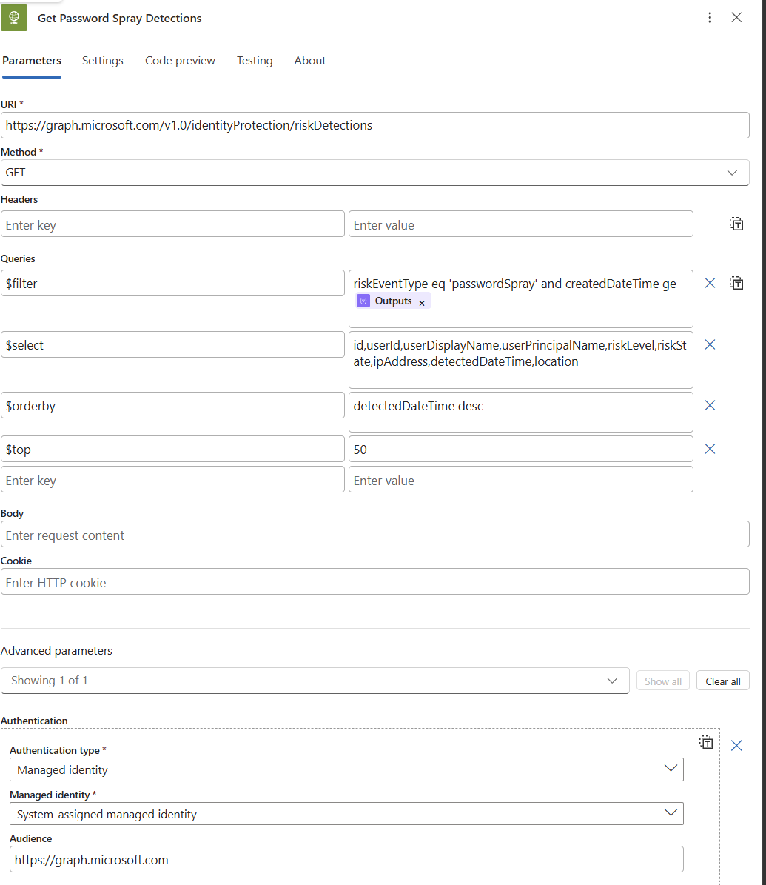

---

### Step 8 — Add Parse JSON Action

1. Click **+** → **Add an action** → search `Parse JSON`
2. **Content**: Body from the HTTP step
3. **Schema**: Use sample payload → paste the sample below → Done

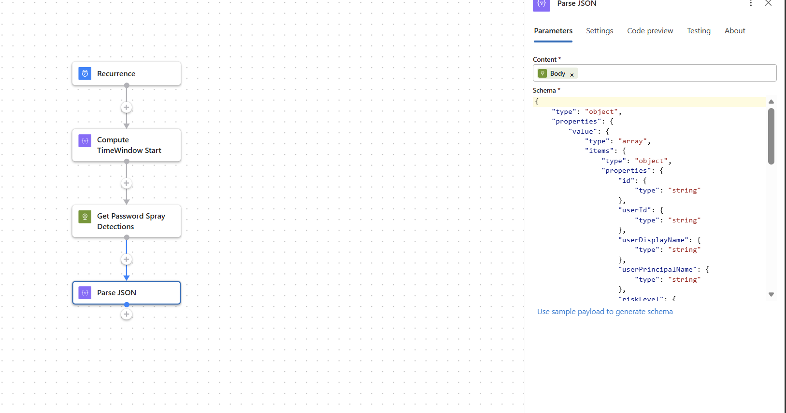

```json
{
  "value": [
    {
      "id": "00000000-0000-0000-0000-000000000000",
      "userId": "00000000-0000-0000-0000-000000000001",
      "userDisplayName": "John Smith",
      "userPrincipalName": "john.smith@contoso.com",
      "riskLevel": "high",
      "riskState": "atRisk",
      "riskEventType": "passwordSpray",
      "ipAddress": "185.220.101.45",
      "detectedDateTime": "2026-07-13T09:15:00Z",
      "location": { "city": "Moscow", "state": "Moscow", "countryOrRegion": "RU" }
    }
  ]
}
```

---

### Step 9 — Add Condition (Check If Detections Exist)

1. **Add an action** → **Condition**
2. Expression: `length(body('Parse_JSON')?['value'])` **is greater than** `0`

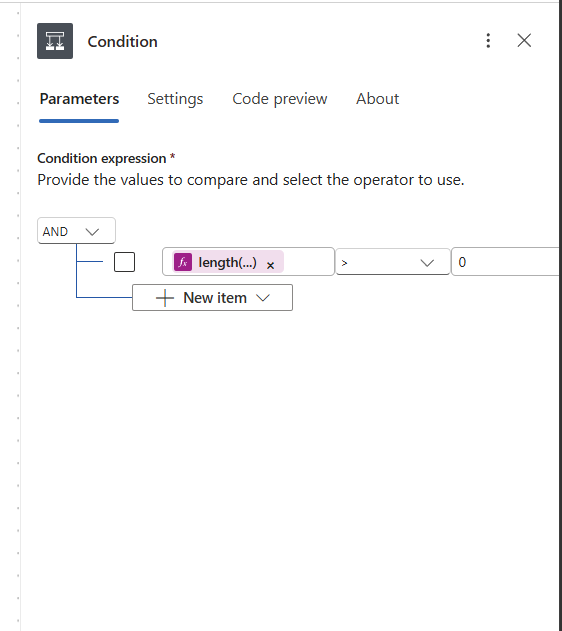

> If you hit `InvalidTemplate` with `greater` type mismatch (`String` vs `Integer`), update the left side to `int(length(body('Parse_JSON')?['value']))`.

All remaining steps go inside the **True** branch.

---

### Step 10 — Initialize Variable

1. **Add an action** → **Initialize variable**
2. **Name**: `SprayReport` | **Type**: `Array` | **Value**: empty

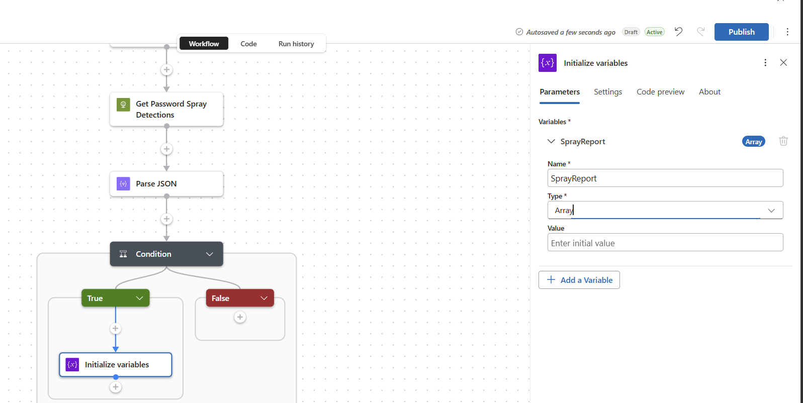

---

### Step 11 — Add For Each Loop

1. **Add an action** → **For each**
2. Output: `body('Parse_JSON')?['value']`

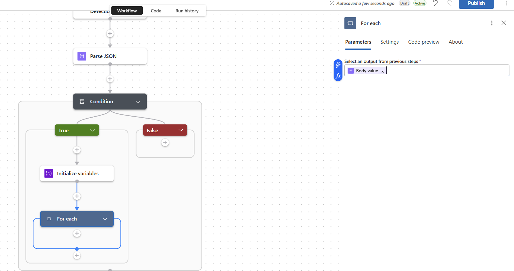

---

### Step 12 — Inside For Each: Format Detection Row

1. **Add an action** → **Compose** → rename `Format_Detection_Row`
2. **Inputs** expression:
   ```
   concat(
     '<tr style=''border-bottom:1px solid #f0f0f0''>',
     '<td style=''padding:8px 10px''>',
       '<div style=''font-weight:500;font-size:13px''>',items('For_each')?['userDisplayName'],'</div>',
       '<div style=''font-size:12px;color:#777;margin-top:2px''>',items('For_each')?['userPrincipalName'],'</div>',
     '</td>',
     '<td style=''padding:8px 10px''>',
       '<div style=''font-family:monospace;font-size:12px''>',coalesce(items('For_each')?['ipAddress'],'Unknown'),'</div>',
       '<div style=''font-size:12px;color:#777;margin-top:2px''>',
         coalesce(items('For_each')?['location']?['city'],''),' ',coalesce(items('For_each')?['location']?['countryOrRegion'],'-'),
       '</div>',
     '</td>',
     '<td style=''padding:8px 10px;font-weight:bold''>',toUpper(coalesce(items('For_each')?['riskLevel'],'NONE')),'</td>',
     '<td style=''padding:8px 10px;font-size:12px;color:#888''>',formatDateTime(items('For_each')?['detectedDateTime'],'yyyy-MM-dd HH:mm'),' UTC','</td>',
     '</tr>'
   )
   ```

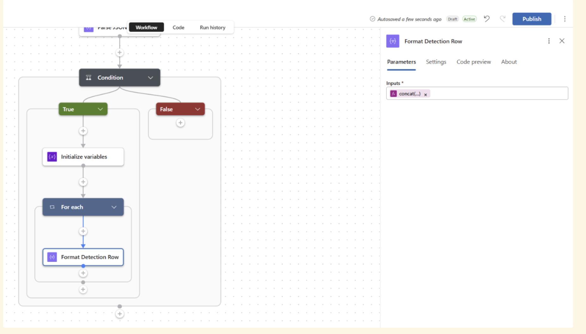

---

### Step 13 — Inside For Each: Append Row to Array

1. **Add an action** → **Append to array variable**
2. **Name**: `SprayReport` | **Value**: `@{outputs('Format_Detection_Row')}`

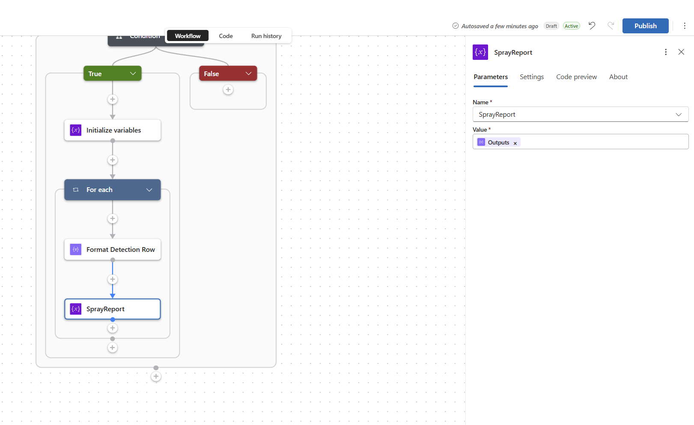

---

### Step 14 — Compose Email Body

1. Outside the For Each → **Add an action** → **Compose** → rename `Compose_Email_Body`
2. Build the full HTML email. Use the [azuredeploy.json](azuredeploy.json) ARM template as the reference for the complete HTML (see the `Compose_Email_Body` action inputs).

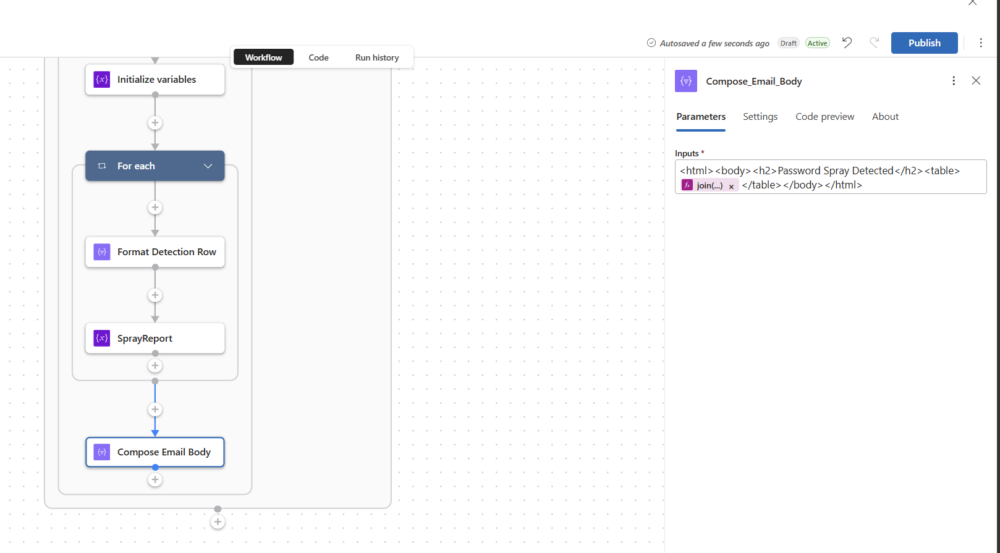

---

### Step 15 — Send Alert Email

1. **Add an action** → **HTTP** → rename `Send_Alert_Email`
2. **Method**: `POST` | **URI**: `https://graph.microsoft.com/v1.0/users/SENDER@yourtenant.com/sendMail`
3. **Headers**: `Content-Type` = `application/json`
4. **Body** (paste valid JSON only; do not prefix with extra text like `Body:`):
   ```json
   {
     "message": {
       "subject": "[CRITICAL] Password Spray Detected",
       "importance": "High",
       "body": { "contentType": "HTML", "content": "@{outputs('Compose_Email_Body')}" },
       "toRecipients": [{ "emailAddress": { "address": "RECIPIENT@yourtenant.com" } }]
     },
     "saveToSentItems": false
   }
   ```
5. **Authentication**: Managed identity / `https://graph.microsoft.com`

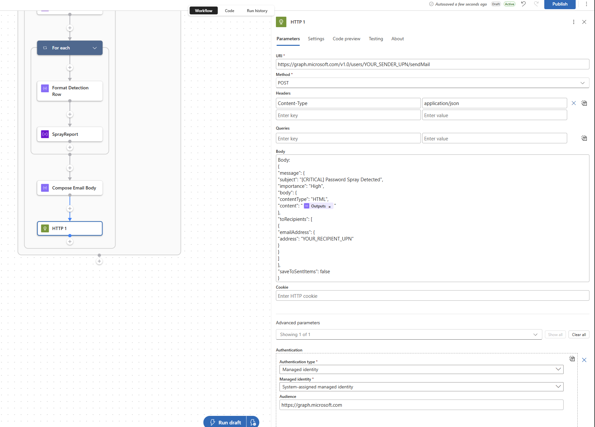

---

### Step 16 — Save and Test

1. Click **Save**
2. Click **Run Trigger** → **Run** for an immediate test
3. Check **Run history** to monitor execution
4. If no detections exist, the run completes silently — this is correct behaviour
5. To generate a test detection: Entra ID → Identity Protection → Simulate risk events

Expected sample email render:

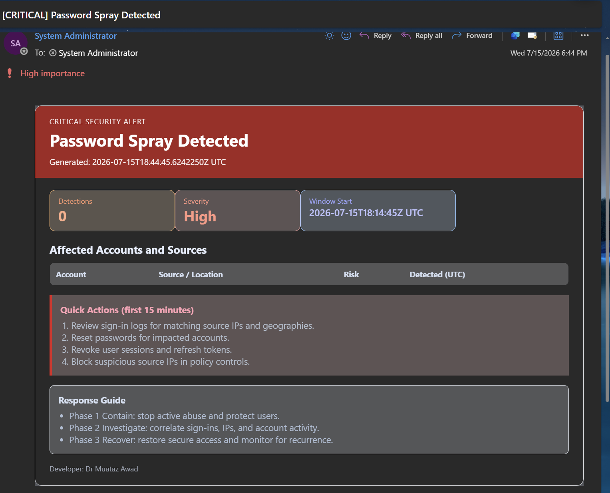

---

## Troubleshooting

| Error | Cause | Fix |
|-------|-------|-----|
| `Forbidden (403)` on riskDetections | `IdentityRiskEvent.Read.All` not yet propagated | Wait 5 minutes after granting and re-run |
| `Forbidden (403)` on sendMail | `Mail.Send` not granted or sender mailbox doesn't exist | Verify sender UPN is a real mailbox in your tenant |
| No email but run succeeds | No `passwordSpray` detections in the polling window | Correct — Logic App is silent when no detections found |
| `InvalidTemplate` on Parse JSON | Schema mismatch | Regenerate schema using "Use sample payload" |
| `BadRequest` on HTTP GET (`could not find property createdDateTime`) | Filter references unsupported field | Use `detectedDateTime` in `$filter` |
| `InvalidTemplate` on Condition (`greater` String/Integer mismatch) | Left and right values are different types | Use `int(length(body('Parse_JSON')?['value']))` on left and numeric `0` on right |
| `ActionConditionFailed` on `Compose_Email_Body` after forced tests | `For_each` was skipped and `runAfter` only allowed `Succeeded` | In `Compose_Email_Body` settings, allow `runAfter` on `For_each` = `Succeeded` and `Skipped` when doing forced test runs |

---

## Security Notes

- **No stored credentials** — Managed Identity eliminates API keys and OAuth connection secrets
- **Least privilege** — Only the three permissions required are granted
- **No data stored** — Reads detections, sends email, discards everything
- **Admin consent required** — All three permissions require explicit Global Administrator consent

---

## Files

| File | Description |
|------|-------------|
| [azuredeploy.json](azuredeploy.json) | ARM template — one-click deployment |
| [deploy.ps1](deploy.ps1) | PowerShell deployment + auto permission grant |
| [../Images](../Images) | Step-by-step portal screenshots used in this guide |
