# Logic Apps Module

Automated security workflows built with Azure Logic Apps that integrate with Microsoft Entra ID, Microsoft Graph API, and Microsoft Security Copilot. These Logic Apps require no OAuth connectors — authentication is handled entirely via System-Assigned Managed Identity.

**Developer**: Dr Muataz Awad

---

## Available Logic Apps

| Logic App | Description |
|-----------|-------------|
| [Daily Risky User Digest](#daily-risky-user-digest) | Sends a daily HTML email digest of all at-risk users from Entra ID Protection |

---

## Daily Risky User Digest

### Overview

A Logic App that runs every day and emails a formatted HTML report of all risky users (`riskState: atRisk`, `riskLevel: high or medium`) from Microsoft Entra ID Protection. Uses **System-Assigned Managed Identity** — no stored credentials, no OAuth connectors.

**What it sends:**

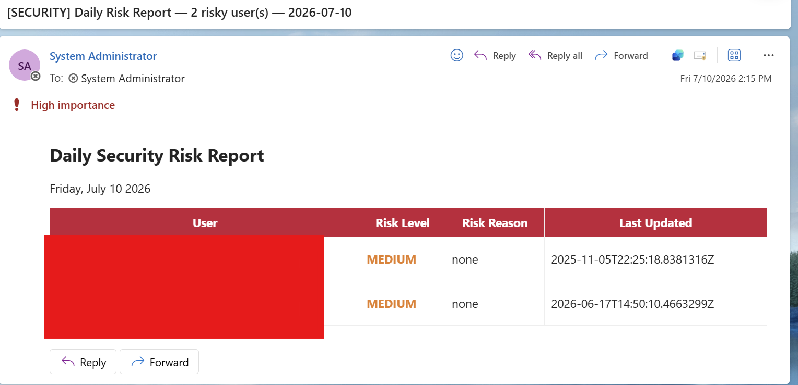

---

### Architecture

```
Recurrence (Daily)
    │
    ▼
Initialize Variable (UserReport: Array)
    │
    ▼
HTTP GET → Graph API riskyUsers
    │
    ▼
Parse JSON (extract value array)
    │
    ▼
For Each risky user
    │   └── Append to array variable (HTML table row)
    │
    ▼
Send Email Report (Graph API sendMail via Managed Identity)
```

**Complete workflow:**

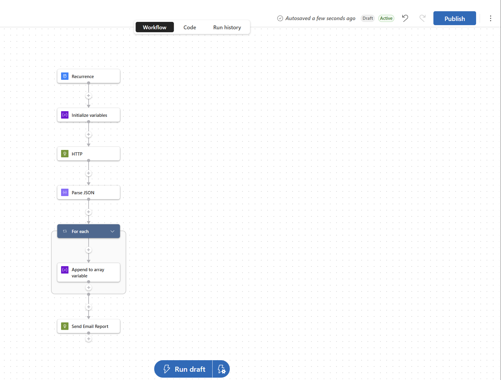

---

### Prerequisites

- Azure subscription with Global Administrator or Security Administrator role
- Microsoft Entra ID P2 license (required for Identity Protection risky users)
- Exchange Online license on the sender mailbox
- Azure Logic Apps (Standard) resource

---

### Deployment

#### Option A — Manual Portal Setup (recommended for learning)

Follow the step-by-step guide below.

#### Option B — ARM Template (automated)

```powershell
cd "Logic Apps Module/Risky User Management/Daily Risky User Digest"
.\deploy.ps1 -SenderEmail "admin@yourtenant.onmicrosoft.com" `
             -RecipientEmail "soc-team@yourtenant.onmicrosoft.com" `
             -SubscriptionId "your-subscription-id" `
             -ResourceGroup "your-resource-group"
```

---

### Step-by-Step Manual Setup Guide

#### Step 1 — Create the Logic App

1. Go to [portal.azure.com](https://portal.azure.com) → search **Logic Apps** → click **+ Create**
2. Select your **Resource Group**, enter name `daily-risky-user-digest`, choose **Standard** plan, **East US** (or your preferred region)
3. Click **Review + Create** → **Create**

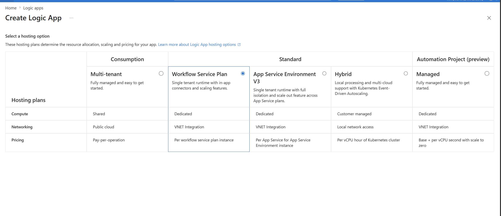

---

#### Step 2 — Enable System-Assigned Managed Identity

1. Open the Logic App → left menu → **Settings** → **Identity**
2. Under **System assigned**, toggle **Status** to **On**
3. Click **Save** → note the **Object (principal) ID** — you will need it for the permission grant step

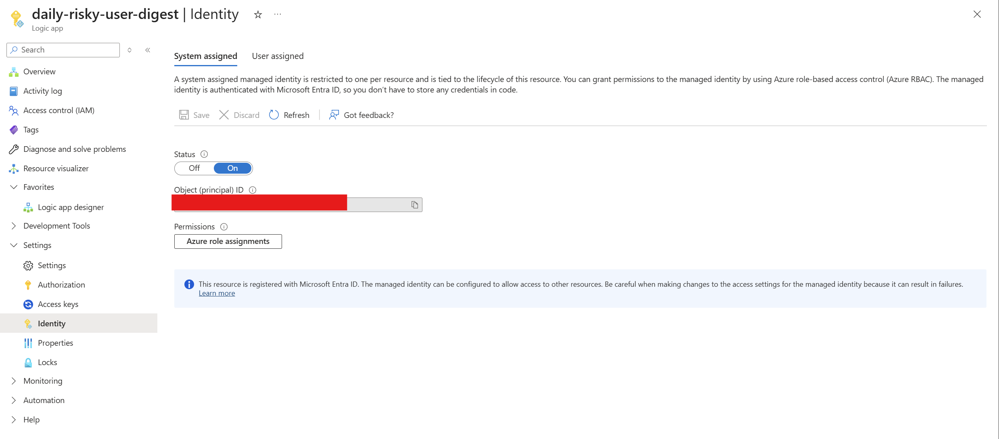

---

#### Step 3 — Grant Microsoft Graph Permissions

Run this PowerShell to grant the 3 required Graph API permissions to the Managed Identity:

```powershell
$token = (az account get-access-token --resource https://graph.microsoft.com --query accessToken -o tsv)
$headers = @{ Authorization = "Bearer $token"; "Content-Type" = "application/json" }

$graphSpId = (az ad sp show --id "00000003-0000-0000-c000-000000000000" --query "id" -o tsv)
$principalId = "YOUR-MANAGED-IDENTITY-OBJECT-ID"  # from Step 2
$uri = "https://graph.microsoft.com/v1.0/servicePrincipals/$graphSpId/appRoleAssignedTo"

$perms = @{
    "IdentityRiskyUser.Read.All" = "dc5007c0-2d7d-4c42-879c-2dab87571379"
    "User.Read.All"              = "df021288-bdef-4463-88db-98f22de89214"
    "Mail.Send"                  = "b633e1c5-b582-4048-a93e-9f11b44c7e96"
}

foreach ($name in $perms.Keys) {
    $body = @{ principalId = $principalId; resourceId = $graphSpId; appRoleId = $perms[$name] } | ConvertTo-Json
    try {
        $null = Invoke-RestMethod -Method POST -Uri $uri -Headers $headers -Body $body
        Write-Host "GRANTED: $name" -ForegroundColor Green
    } catch {
        Write-Host "ALREADY EXISTS or ERROR: $name" -ForegroundColor Yellow
    }
}
```

**Verify in the portal:** Entra ID → Enterprise Applications → search `daily-risky-user-digest` → Security → Permissions

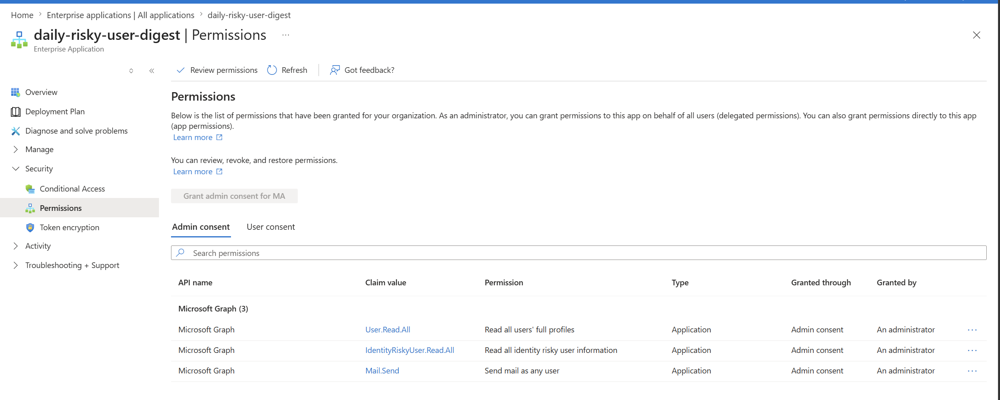

---

#### Step 4 — Open the Logic App Designer

1. In the Logic App → left menu → **Logic app designer** (under Favorites)
2. Click **+ Add trigger**

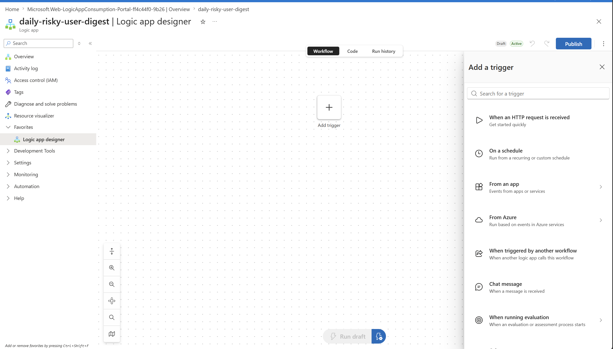

---

#### Step 5 — Add Recurrence Trigger

1. Select **"On a schedule"** → **Recurrence**
2. Set: **Interval** = `1`, **Frequency** = `Day`
3. Set your **Time zone**, optionally set a **Start time** (e.g., `2026-01-01T08:00:00Z` for 8 AM daily)

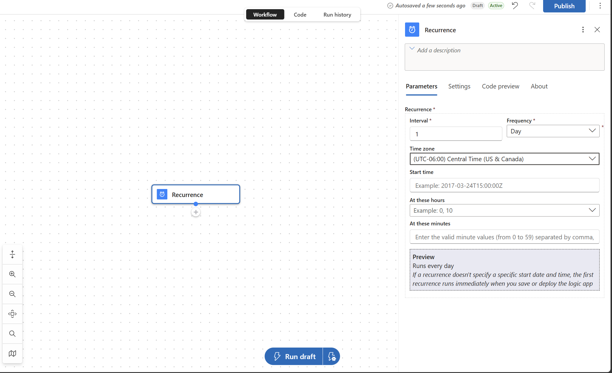

---

#### Step 6 — Add Initialize Variables Action

1. Click **+** below Recurrence → **Add an action**
2. Search `Initialize variable` → select **Initialize variables** (Built-in)

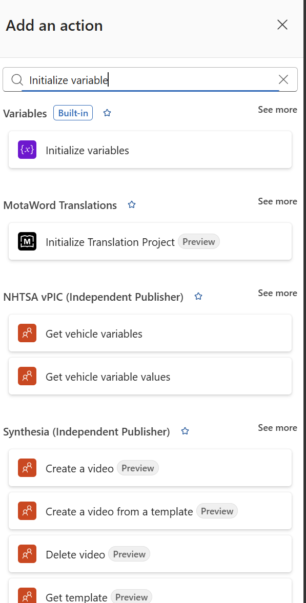

3. Configure:
   - **Name**: `UserReport`
   - **Type**: `Array`
   - **Value**: leave empty

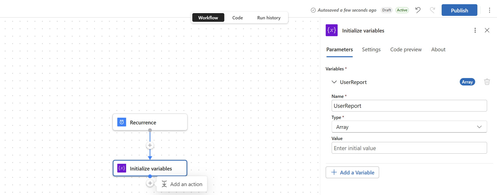

---

#### Step 7 — Add HTTP Action (Get Risky Users)

1. Click **+** below Initialize variables → **Add an action**
2. Search `HTTP` → select **HTTP** (Built-in)

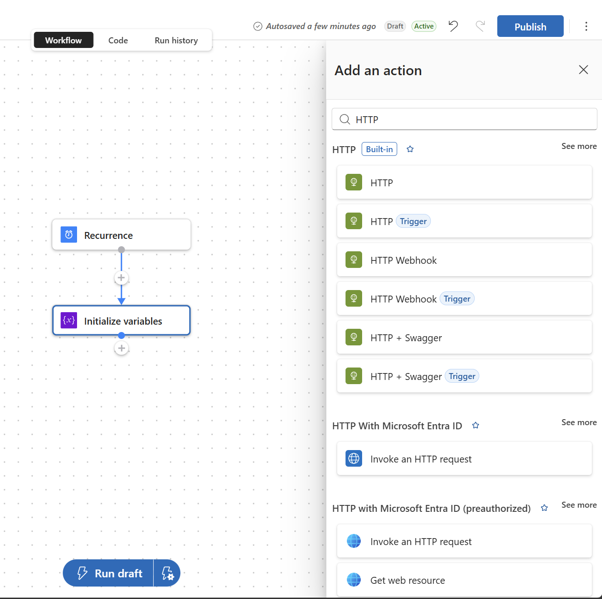

3. Configure:
   - **Method**: `GET`
   - **URI**: `https://graph.microsoft.com/v1.0/identityProtection/riskyUsers`
   - **Queries** section — add these 4 rows:

| Key | Value |
|-----|-------|
| `$filter` | `riskState eq 'atRisk' and (riskLevel eq 'high' or riskLevel eq 'medium')` |
| `$select` | `id,userDisplayName,userPrincipalName,riskLevel,riskDetail,riskLastUpdatedDateTime` |
| `$orderby` | `riskLevel desc` |
| `$top` | `50` |

4. Scroll down → **Advanced parameters** → add **Authentication**:
   - **Authentication type**: `Managed identity`
   - **Managed identity**: `System-assigned managed identity`
   - **Audience**: `https://graph.microsoft.com`

---

#### Step 8 — Add Parse JSON Action

1. Click **+** → **Add an action** → search `Parse JSON` → select **Parse JSON** (Built-in)

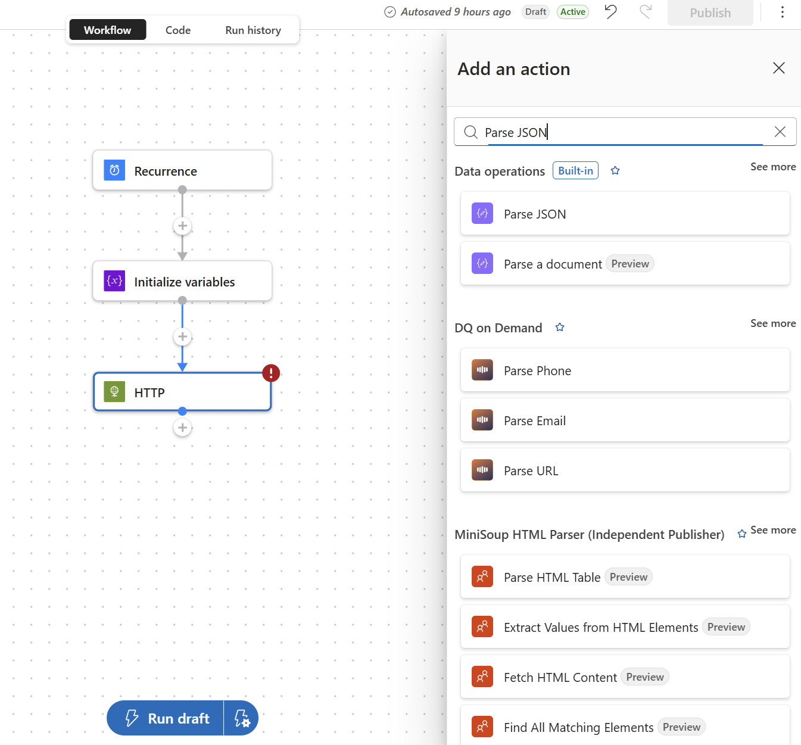

2. Configure:
   - **Content**: click the expression field → select `Body` from the HTTP step output
   - **Schema**: click **"Use sample payload to generate schema"**, paste the sample below, click **Done**

```json
{
  "@odata.context": "https://graph.microsoft.com/v1.0/$metadata#identityProtection/riskyUsers",
  "value": [
    {
      "id": "00000000-0000-0000-0000-000000000000",
      "userDisplayName": "Test User",
      "userPrincipalName": "user@domain.com",
      "riskLevel": "high",
      "riskDetail": "none",
      "riskLastUpdatedDateTime": "2026-01-01T08:00:00Z"
    }
  ]
}
```

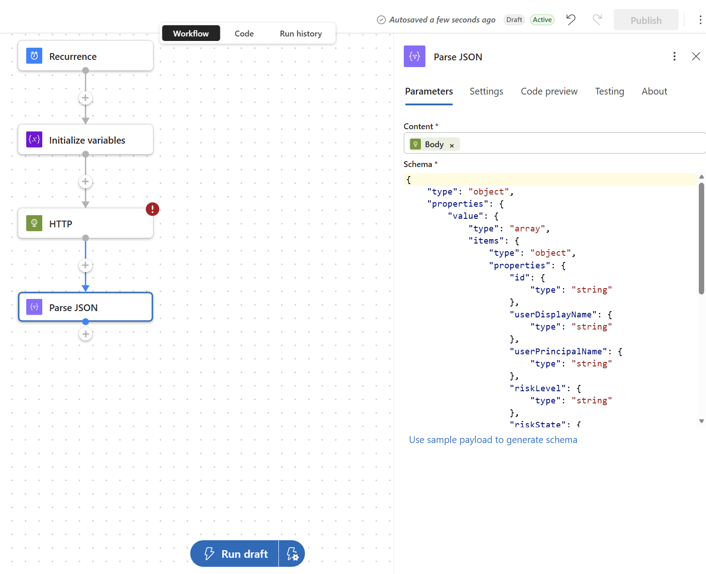

---

#### Step 9 — Add For Each Loop

1. Click **+** → **Add an action** → search `For each` → select **For each** (Built-in)
2. In **"Select an output from previous steps"**, enter the expression:

```
body('Parse_JSON')?['value']
```

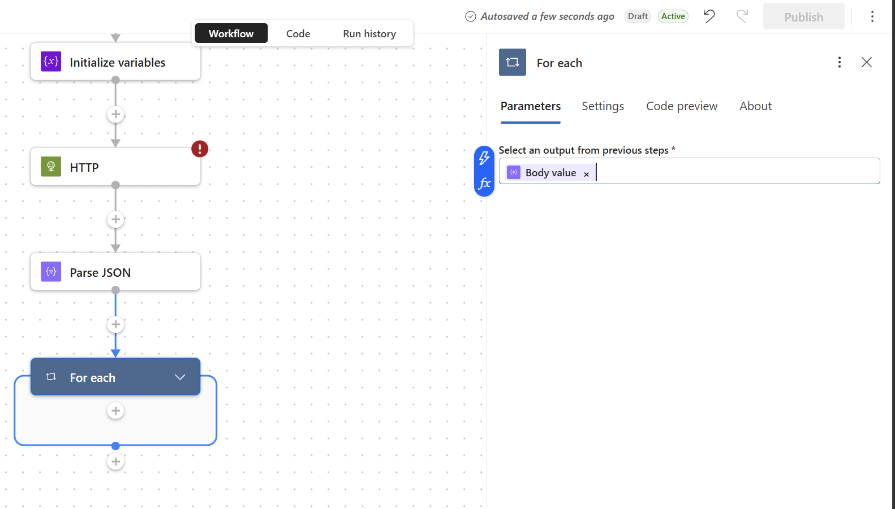

---

#### Step 10 — Add Append to Array Variable (inside For Each)

1. Inside the For Each loop, click **+** → **Add an action** → search `Append to array variable`
2. Configure:
   - **Name**: `UserReport`
   - **Value**: paste this expression (switch to expression mode using the `fx` button):

```
concat('<tr><td style="padding:8px;border-bottom:1px solid #eee">',
items('For_each')?['userDisplayName'],
'<br/><small style="color:#666">',
items('For_each')?['userPrincipalName'],
'</small></td><td style="padding:8px;border-bottom:1px solid #eee;color:',
if(equals(items('For_each')?['riskLevel'], 'high'), '#C41E3A', '#E67E22'),
'"><strong>',
toUpper(items('For_each')?['riskLevel']),
'</strong></td><td style="padding:8px;border-bottom:1px solid #eee">',
items('For_each')?['riskDetail'],
'</td><td style="padding:8px;border-bottom:1px solid #eee">',
items('For_each')?['riskLastUpdatedDateTime'],
'</td></tr>')
```

---

#### Step 11 — Add Send Email Report Action (HTTP POST to Graph sendMail)

1. Outside the For Each loop, click **+** → **Add an action** → search `HTTP` → select **HTTP** (Built-in)
2. Rename it to **"Send Email Report"** (click ⋯ → Rename)
3. Configure:
   - **Method**: `POST`
   - **URI**: `https://graph.microsoft.com/v1.0/users/SENDER@yourtenant.onmicrosoft.com/sendMail`
   - **Headers**: `Content-Type` = `application/json`
   - **Body**: paste the JSON below (replacing expressions as needed)

```json
{
  "message": {
    "subject": "[SECURITY] Daily Risk Report — <length(variables('UserReport'))> risky user(s) — <formatDateTime(utcNow(), 'yyyy-MM-dd')>",
    "importance": "High",
    "body": {
      "contentType": "HTML",
      "content": "<html><body><h2>Daily Security Risk Report</h2><p><formatDateTime(utcNow(), 'dddd, MMMM d yyyy')></p><table border='1' cellpadding='8' style='border-collapse:collapse;width:100%'><thead><tr style='background:#C41E3A;color:white'><th>User</th><th>Risk Level</th><th>Risk Reason</th><th>Last Updated</th></tr></thead><tbody><join(variables('UserReport'), '')></tbody></table></body></html>"
    },
    "toRecipients": [
      {
        "emailAddress": {
          "address": "RECIPIENT@yourtenant.onmicrosoft.com"
        }
      }
    ]
  }
}
```

> **Note**: In the Logic Apps designer, use dynamic content tokens for `length(...)`, `formatDateTime(...)`, and `join(...)` rather than typing them as plain text.

4. Scroll down → **Advanced parameters** → add **Authentication**:
   - **Authentication type**: `Managed identity`
   - **Managed identity**: `System-assigned managed identity`
   - **Audience**: `https://graph.microsoft.com`

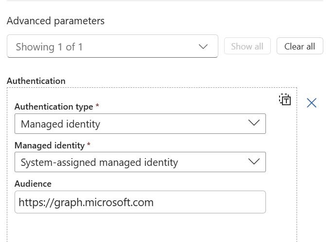

---

#### Step 12 — Publish and Test

1. Click **Publish** at the top right
2. Click **Run draft** to trigger an immediate test run
3. Click **Run history** tab to monitor the execution


**Expected email result:**


---

### Troubleshooting

| Error | Cause | Fix |
|-------|-------|-----|
| `Whitespaces must be encoded for URIs` | Space in the URI field | Move OData query params to the **Queries** section instead of the URI |
| `ValidationFailed` on Parse JSON | Schema doesn't match actual response | Click "Use sample payload to generate schema" with actual Graph API response |
| `Forbidden` (403) on sendMail | Token not yet propagated after permission grant | Wait 5 minutes and re-run; permissions need time to propagate |
| Publish button greyed out | Red `!` on an action indicates a validation error | Fix all actions with error indicators first |

---

### Files

| File | Description |
|------|-------------|
| [azuredeploy.json](Risky%20User%20Management/Daily%20Risky%20User%20Digest/azuredeploy.json) | ARM template for automated deployment |
| [deploy.ps1](Risky%20User%20Management/Daily%20Risky%20User%20Digest/deploy.ps1) | PowerShell deployment script |

---

### Security Notes

- **No stored credentials** — Managed Identity eliminates the need for API keys or OAuth connection secrets
- **Least privilege** — Only `IdentityRiskyUser.Read.All`, `User.Read.All`, and `Mail.Send` are granted
- **Admin consent** — All permissions require explicit admin consent, visible in Entra ID Enterprise Applications
