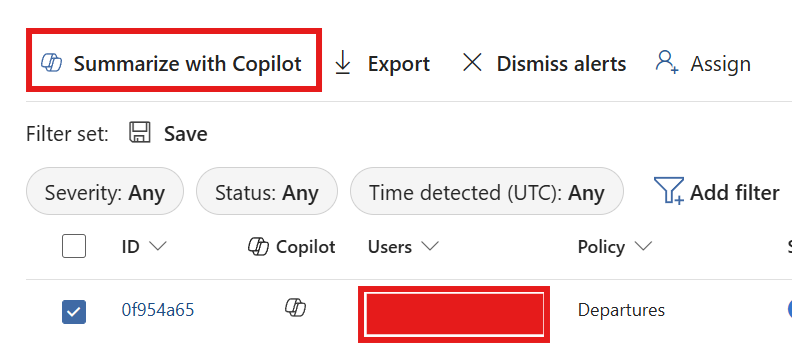
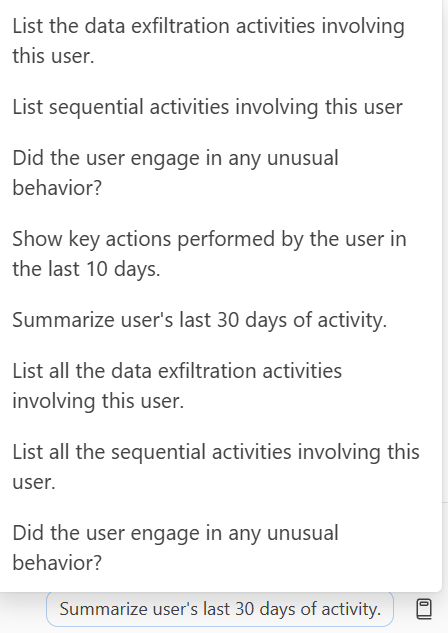

# User Investigation Guide

**Developer**: Dr Muataz Awad

## Overview

This guide explains how to investigate a user within the Purview portal using the Security Copilot embedded experience for IRM (Insider Risk Management) alerts.

## Steps to Investigate a User

### 1. Launch Purview Portal

Navigate to the Purview portal at https://purview.microsoft.com.

### 2. Go to the IRM Workload

From the main navigation, select **Insider Risk Management** from the available workloads.

### 3. Click on the User to Investigate

In the IRM alerts or cases view, select the user you want to investigate. This will open their profile or case details.

### 4. Click "Summarize with Copilot"

Once the user's details are displayed, locate the **Summarize with Copilot** button at the top of the page and click it. This will launch the Security Copilot embedded experience to analyze the user's activity and risks.

Security Copilot will provide an automated analysis of the user's insider risk profile, including activity summaries, risk indicators, and recommended investigation steps.

### 5. View Additional Investigation Prompts

Click on **View Prompts** to the right side of the screen to access additional investigation prompts. These prompts allow you to expand your investigation with various analysis options, such as:

- List data exfiltration activities involving this user
- List sequential activities involving this user
- Identify unusual behavior patterns
- Show key actions performed in the last 10 days
- Summarize the user's last 30 days of activity
- And more...

Select any prompt to dive deeper into specific aspects of the user's insider risk profile.

## Notes

- The embedded experience requires Security Copilot to be enabled in your organization
- Ensure you have the necessary permissions to access IRM data
- Results may vary based on available data and configured risk indicators
