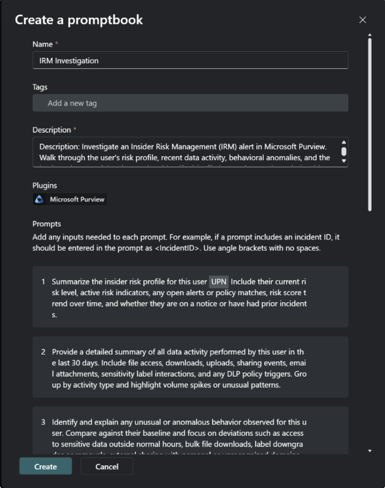
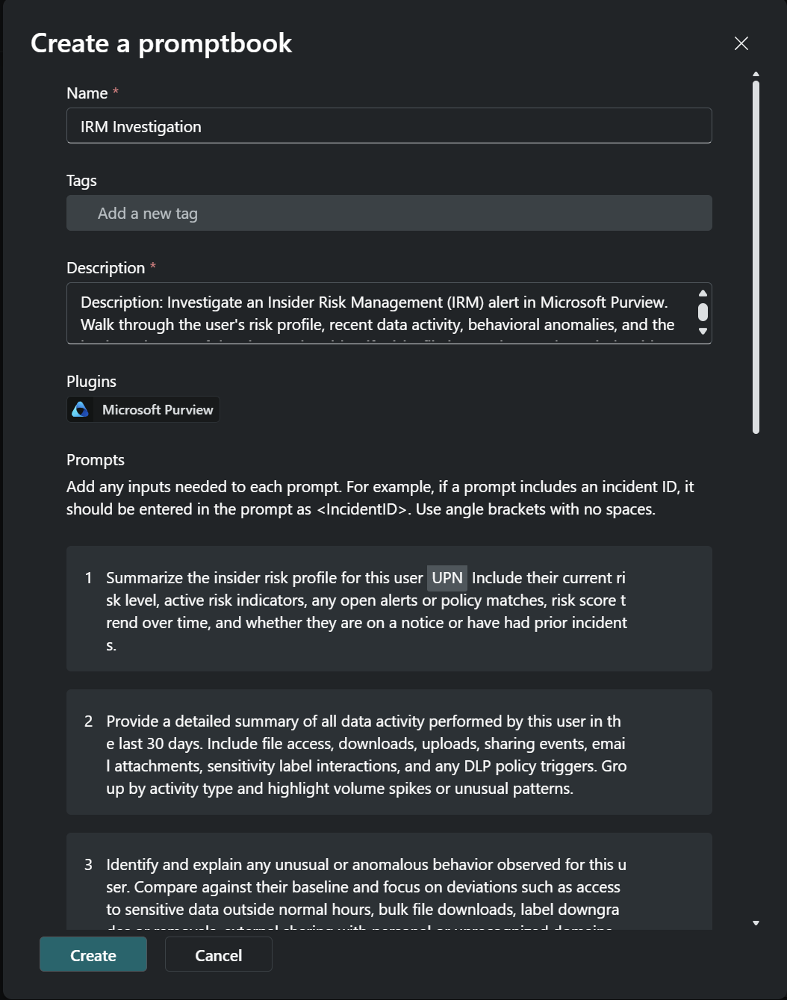
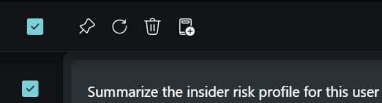
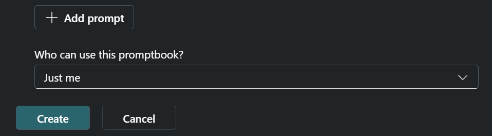

# IRM Investigation

**Developer**: Dr Muataz Awad

**Description**: Investigate an Insider Risk Management (IRM) alert in Microsoft Purview. Walk through the user's risk profile, recent data activity, behavioral anomalies, and the business impact of the alert — then identify risky file interactions and conclude with recommended triage and mitigation actions. Results may be limited or incomplete if required Purview plugins are not enabled or if the user running the promptbook does not have the necessary permissions.

---

1. Summarize the user's current insider risk profile
```
Summarize the insider risk profile for this user <UPN>. Include their current risk level, active risk indicators, any open alerts or policy matches, risk score trend over time, and whether they are on a notice or have had prior incidents.
```

2. Summarize the user's data activity over the last 30 days
```
Provide a detailed summary of all data activity performed by this user in the last 30 days. Include file access, downloads, uploads, sharing events, email attachments, sensitivity label interactions, and any DLP policy triggers. Group by activity type and highlight volume spikes or unusual patterns.
```

3. Highlight unusual or anomalous behavior for this user
```
Identify and explain any unusual or anomalous behavior observed for this user. Compare against their baseline and focus on deviations such as access to sensitive data outside normal hours, bulk file downloads, label downgrades or removals, external sharing with personal or unrecognized domains, or access from unexpected locations or devices.
```

4. Explain the potential business impact of this alert
```
Based on the risk indicators and data activity observed for this user, explain the potential business impact if this behavior represents a genuine insider threat. Include the sensitivity of the data involved, the breadth of exposure, regulatory or compliance implications, and any reputational or operational risk to the organization.
```

5. Show all users who accessed the file in the last 30 days
```
List all users who accessed, modified, shared, or interacted with the specified file in the last 30 days. Include their UPN, the type of action performed, the date and time, the device used, and whether the action triggered any DLP or sensitivity policy.
```

6. Identify risky actions taken on this file
```
Identify all risky or policy-violating actions taken on the specified file. Include label downgrades or removals, exports to unprotected formats, printing, external sharing, forwarding, bulk copy or download events, and any DLP rule matches. For each action, specify the user, timestamp, and risk severity.
```

7. Summarize the session and provide recommended actions
```
Summarize the full IRM investigation for this user and the specified file. Provide a risk verdict of Low, Medium, High, or Critical with justification. Then list specific recommended actions to investigate further, triage the alert, and mitigate the identified insider risk behaviors — including any suggested containment steps, HR or legal escalation triggers, or policy tuning recommendations.
```

---

## How To Create This Promptbook In Security Copilot

1. Open Create a promptbook and enter the name IRM Investigation.
2. Add the description and select the Microsoft Purview plugin.
3. Paste each prompt in order (1 through 7), then review formatting.
4. Choose who can use the promptbook and select Create.
5. Verify the success message and open the promptbook from the library.

### UI Walkthrough Screenshots








