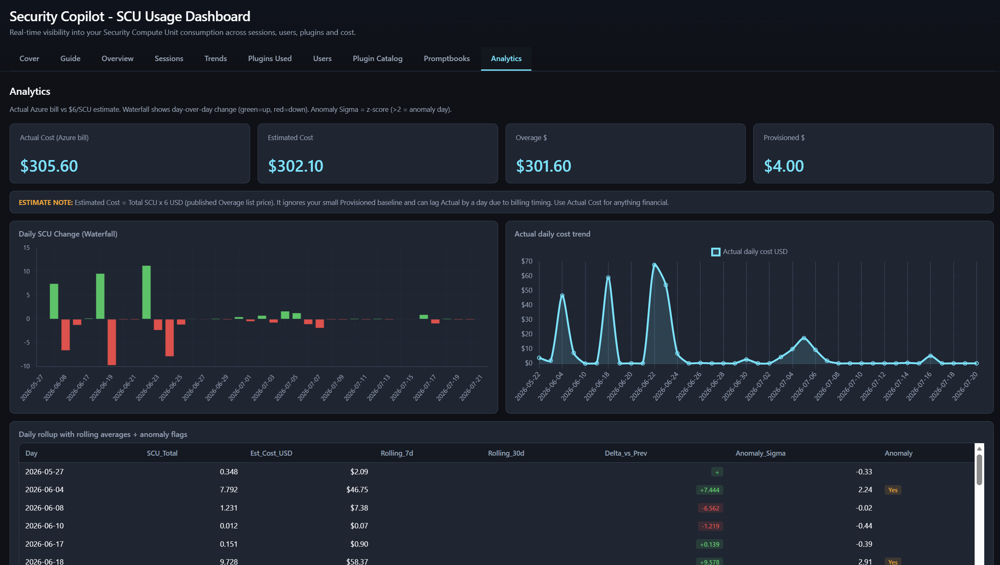
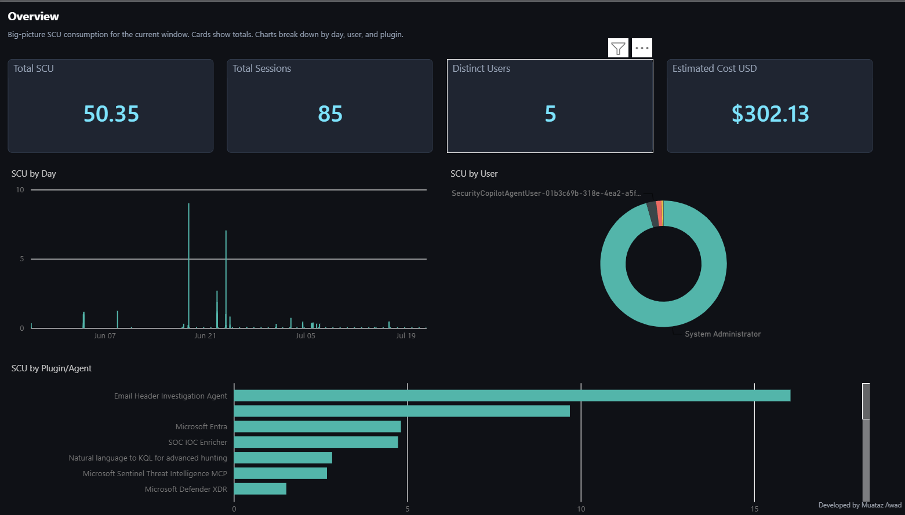
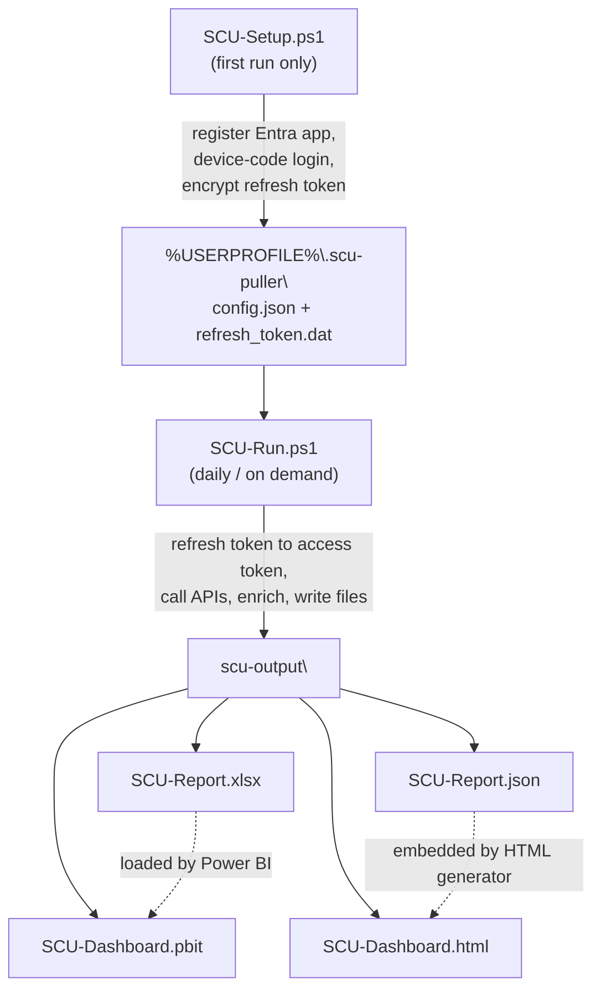

# Security Copilot SCU Reporting

Pull Security Copilot **Security Compute Unit (SCU)** consumption and regenerate
Power BI + HTML dashboards with a single command.

**Repository:** <https://github.com/Muatazawad2/SecurityCopilot>


## Dashboards

Both views below are generated from a single data pull — no manual chart building.

**Interactive HTML dashboard** — a single self-contained file that opens in any browser (Analytics tab shown):



**Power BI dashboard** — the `.pbit` template loaded with data (Overview page shown):



## Contents

| File | Purpose |
| --- | --- |
| `SCU-Setup.ps1` | **One-time setup.** Registers an Entra app, grants admin consent, signs you in via device code, and saves a DPAPI-encrypted refresh token for silent daily runs. |
| `SCU-Run.ps1` | **Everyday run.** Pulls fresh data and rebuilds the Excel report, Power BI template, and HTML dashboard. |
| `SCU-Dashboard.pbit` | Pre-built Power BI template (model schema + visuals, no data). Loads `SCU-Report.xlsx` on open. |

## Prerequisites

- Windows with **PowerShell 7+** — `winget install Microsoft.PowerShell`
- **Azure CLI** — `winget install Microsoft.AzureCLI`
- **ImportExcel** module — `SCU-Setup.ps1` installs it automatically if missing
- An account with access to Security Copilot
- For app registration + admin consent: Application Developer **and** one of
  Global Admin / Privileged Role Admin / Cloud Application Admin (or ask your
  admin — see [docs/APP-REGISTRATION.md](docs/APP-REGISTRATION.md))

## Quick start

```powershell
# 1. One time only - register app, consent, sign in, save encrypted refresh token
.\SCU-Setup.ps1

# 2. Every day / on demand - pull data + rebuild dashboards
.\SCU-Run.ps1
```

If your admin already registered the shared app, reuse it and skip creation:

```powershell
.\SCU-Setup.ps1 -AppId <client-id>
```

The refresh token stays valid ~90 days. If it expires, just re-run `SCU-Setup.ps1`.

## `SCU-Run.ps1` flags

| Flag | Effect |
| --- | --- |
| `-Days <n>` | Data window in days (default `90`). |
| `-NoRefresh` | Reuse existing data; just rebuild the dashboards. |
| `-HtmlOnly` | Skip Power BI entirely (still refreshes data + rebuilds/opens HTML). |
| `-SkipPbit` | Skip regenerating the `.pbit` template. |
| `-SkipHtml` | Skip regenerating the HTML dashboard. |
| `-NoOpen` | Regenerate everything but open nothing (ideal for scheduled tasks). |
| `-OutDir <path>` | Output folder (default `.\scu-output`). |
| `-ConfigDir <path>` | Config + token folder (default `%USERPROFILE%\.scu-puller`). |

## Outputs (`scu-output\`)

| File | Description |
| --- | --- |
| `SCU-Report.xlsx` | Raw + aggregated data across multiple sheets. |
| `SCU-Report.json` | Same data as JSON — source for the HTML dashboard. |
| `SCU-Dashboard.pbit` | Regenerated Power BI template. |
| `SCU-Dashboard.html` | Self-contained interactive HTML dashboard (open in any browser). |

## How it fits together



## Entra app registration

`SCU-Setup.ps1` registers the required Entra app automatically. If you'd rather do
it by hand — or your admin manages app registrations centrally — follow the
step-by-step guide (Azure CLI and Portal methods, plus verification):

- [docs/APP-REGISTRATION.md](docs/APP-REGISTRATION.md)

---

**Developer**: Dr Muataz Awad
